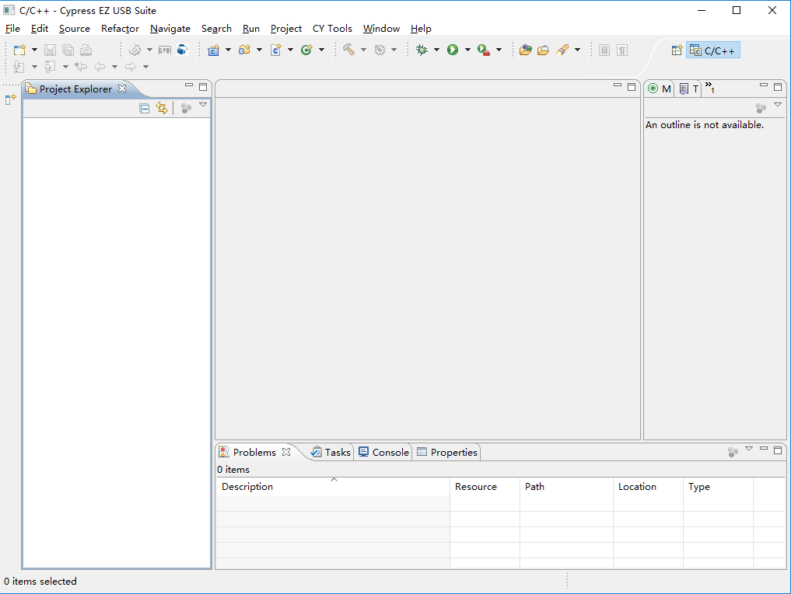
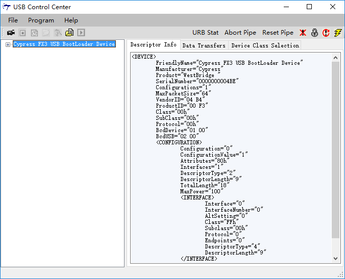

# Install

## 参考文档

* [CYUSB3KIT-003 SuperSpeed Explorer Kit Setup (Rev **) (Kit Design Files, FX3 SDK, Eclipse IDE, GPIF II Designer, CyUSBSuite, Documentation)](https://www.cypress.com/file/134006/download)
* [SuperSpeed Explorer Kit Hardware Files](https://www.cypress.com/file/133841/download)
  * [SuperSpeed_Explorer_Kit_Schematic.pdf](docs/refers/SuperSpeed_Explorer_Kit_Schematic.pdf)
* [SuperSpeed Explorer Kit User Guide](https://www.cypress.com/file/133836/download)

## SDK

* [CYUSB3KIT-003 SuperSpeed Explorer Kit Setup (Rev **) (Kit Design Files, FX3 SDK, Eclipse IDE, GPIF II Designer, CyUSBSuite, Documentation)](https://www.cypress.com/file/134006/download)

## JRE Install

* **32bit jre**
* 安装路径: `C:\Program Files (x86)\Cypress\EZ-USB FX3 SDK\1.3\jre7`
* eclipse  
  

## Eclipse Project

* [SuperSpeed Explorer Kit User Guide](https://www.cypress.com/file/133836/download)
  * 2.6 EZ USB Suite (Eclipse) IDE

## Boot Options

the SuperSpeed Explorer Kit development board supports the USB and I2C boot options, When the J4 jumper is removed, FX3 boots from the onboard I2C EEPROM if a valid firmware image is available in the EEPROM; otherwise, FX3 falls back to USB boot. When the J4 jumper is inserted, FX3 allows firmware download through USB.

