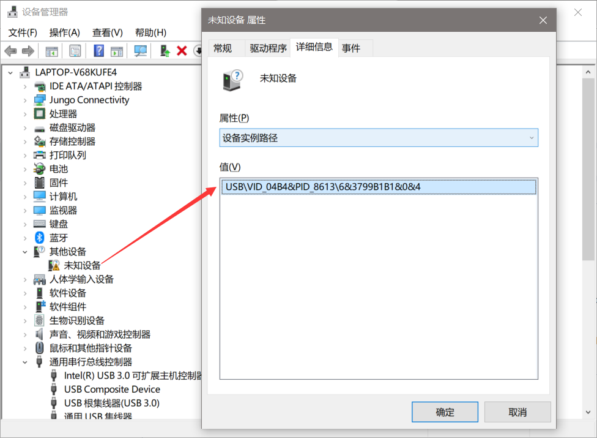
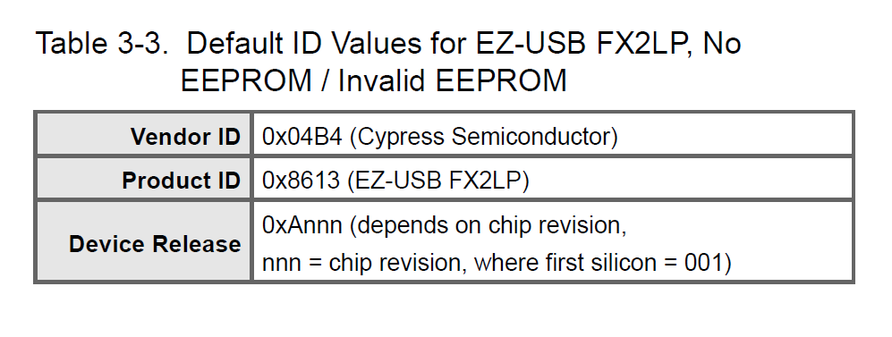
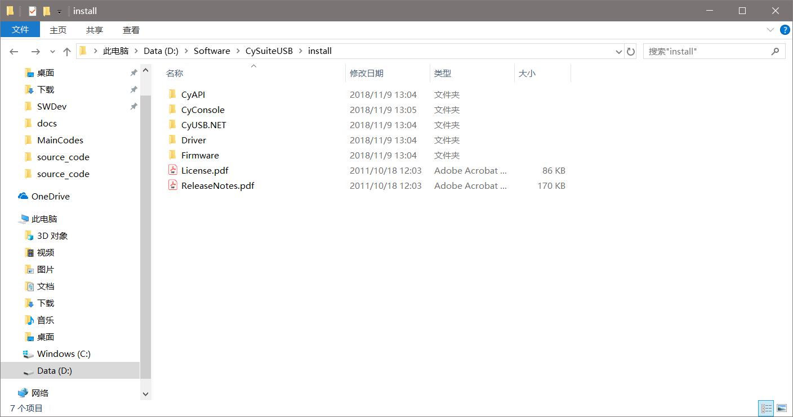
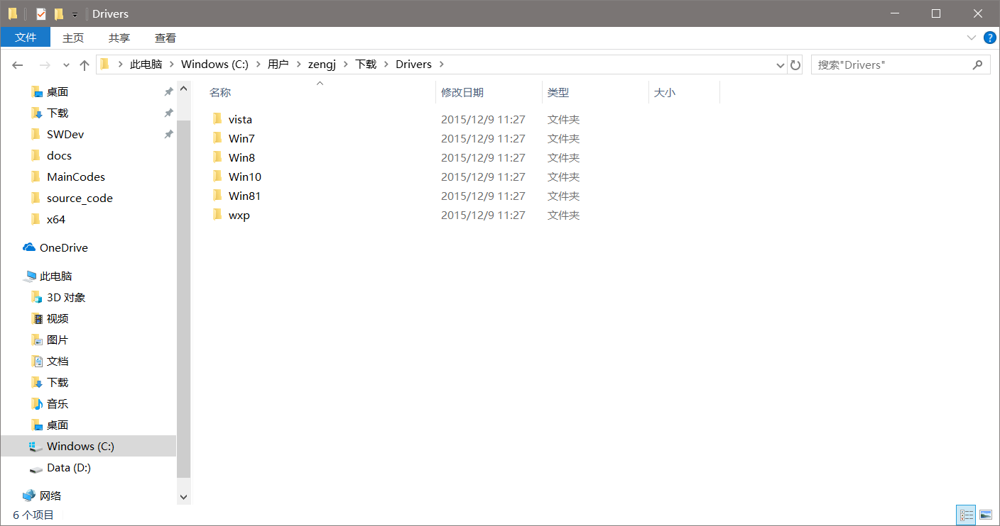
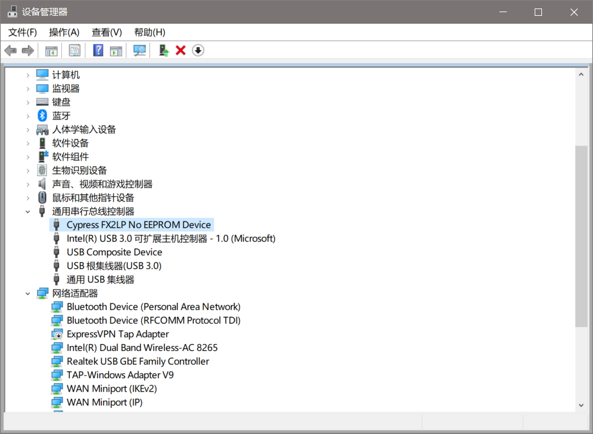
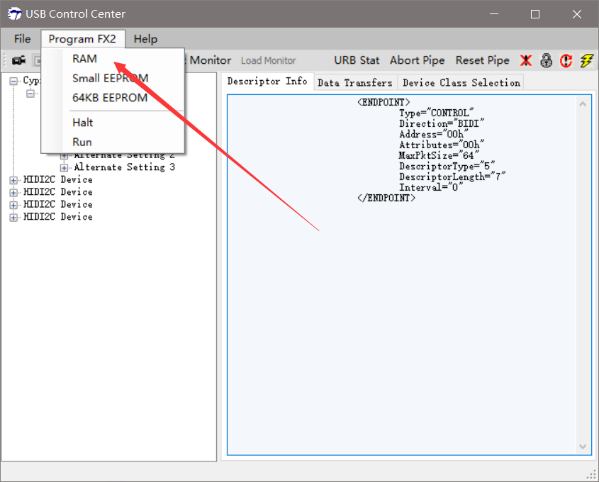

# Quick Start

## 参考文档

* [AN65209 Getting Started with FX2LP(Chinese).pdf](http://www.cypress.com/file/44946/download)
* [CY3684 DVK Quick Start Guide (Chinese).pdf](http://www.cypress.com/file/393081/download)
* [Drivers for EZ-USB® FX1™, FX2LP™ , and FX3 - KBA94413](https://community.cypress.com/docs/DOC-12366)

## Plugin Device



`USB\VID_04B4&PID_8613\6&3799B1B1&0&4`  


## Download SuiteUSB And Install Driver

* [SuiteUSB 3.4 - USB Development tools for Visual Studio](http://www.cypress.com/documentation/software-and-drivers/suiteusb-34-usb-development-tools-visual-studio)
  
* [Drivers for EZ-USB® FX1™, FX2LP™ , and FX3 - KBA94413](https://community.cypress.com/docs/DOC-12366)
  



## USB Control Center

* `<install path>/CyUSB.NET/bin/CyControl.exe`;
  

```
<DEVICE>
    FriendlyName="Cypress FX2LP No EEPROM Device"
    Manufacturer=""
    Product=""
    SerialNumber=""
    Configurations="1"
    MaxPacketSize="64"
    VendorID="04 B4"
    ProductID="86 13"
    Class="FFh"
    SubClass="FFh"
    Protocol="FFh"
    BcdDevice="A0 01"
    BcdUSB="02 00"
    <CONFIGURATION>
        Configuration="0"
        ConfigurationValue="1"
        Attributes="80h"
        Interfaces="1"
        DescriptorType="2"
        DescriptorLength="9"
        TotalLength="171"
        MaxPower="50"
        <INTERFACE>
            Interface="0"
            InterfaceNumber="0"
            AltSetting="0"
            Class="FFh"
            Subclass="FFh"
            Protocol="255"
            Endpoints="0"
            DescriptorType="4"
            DescriptorLength="9"
        </INTERFACE>
        <INTERFACE>
            Interface="0"
            InterfaceNumber="0"
            AltSetting="1"
            Class="FFh"
            Subclass="FFh"
            Protocol="255"
            Endpoints="6"
            DescriptorType="4"
            DescriptorLength="9"
            <ENDPOINT>
                Type="BULK"
                Direction="OUT"
                Address="01h"
                Attributes="02h"
                MaxPktSize="512"
                DescriptorType="5"
                DescriptorLength="7"
                Interval="0"
            </ENDPOINT>
            <ENDPOINT>
                Type="BULK"
                Direction="IN"
                Address="81h"
                Attributes="02h"
                MaxPktSize="512"
                DescriptorType="5"
                DescriptorLength="7"
                Interval="0"
            </ENDPOINT>
            <ENDPOINT>
                Type="BULK"
                Direction="OUT"
                Address="02h"
                Attributes="02h"
                MaxPktSize="512"
                DescriptorType="5"
                DescriptorLength="7"
                Interval="0"
            </ENDPOINT>
            <ENDPOINT>
                Type="BULK"
                Direction="OUT"
                Address="04h"
                Attributes="02h"
                MaxPktSize="512"
                DescriptorType="5"
                DescriptorLength="7"
                Interval="0"
            </ENDPOINT>
            <ENDPOINT>
                Type="BULK"
                Direction="IN"
                Address="86h"
                Attributes="02h"
                MaxPktSize="512"
                DescriptorType="5"
                DescriptorLength="7"
                Interval="0"
            </ENDPOINT>
            <ENDPOINT>
                Type="BULK"
                Direction="IN"
                Address="88h"
                Attributes="02h"
                MaxPktSize="512"
                DescriptorType="5"
                DescriptorLength="7"
                Interval="0"
            </ENDPOINT>
        </INTERFACE>
        <INTERFACE>
            Interface="0"
            InterfaceNumber="0"
            AltSetting="2"
            Class="FFh"
            Subclass="FFh"
            Protocol="255"
            Endpoints="6"
            DescriptorType="4"
            DescriptorLength="9"
            <ENDPOINT>
                Type="INTERRUPT"
                Direction="OUT"
                Address="01h"
                Attributes="03h"
                MaxPktSize="64"
                DescriptorType="5"
                DescriptorLength="7"
                Interval="1"
            </ENDPOINT>
            <ENDPOINT>
                Type="INTERRUPT"
                Direction="IN"
                Address="81h"
                Attributes="03h"
                MaxPktSize="64"
                DescriptorType="5"
                DescriptorLength="7"
                Interval="1"
            </ENDPOINT>
            <ENDPOINT>
                Type="INTERRUPT"
                Direction="OUT"
                Address="02h"
                Attributes="03h"
                MaxPktSize="512"
                DescriptorType="5"
                DescriptorLength="7"
                Interval="1"
            </ENDPOINT>
            <ENDPOINT>
                Type="BULK"
                Direction="OUT"
                Address="04h"
                Attributes="02h"
                MaxPktSize="512"
                DescriptorType="5"
                DescriptorLength="7"
                Interval="0"
            </ENDPOINT>
            <ENDPOINT>
                Type="INTERRUPT"
                Direction="IN"
                Address="86h"
                Attributes="03h"
                MaxPktSize="512"
                DescriptorType="5"
                DescriptorLength="7"
                Interval="1"
            </ENDPOINT>
            <ENDPOINT>
                Type="BULK"
                Direction="IN"
                Address="88h"
                Attributes="02h"
                MaxPktSize="512"
                DescriptorType="5"
                DescriptorLength="7"
                Interval="0"
            </ENDPOINT>
        </INTERFACE>
        <INTERFACE>
            Interface="0"
            InterfaceNumber="0"
            AltSetting="3"
            Class="FFh"
            Subclass="FFh"
            Protocol="255"
            Endpoints="6"
            DescriptorType="4"
            DescriptorLength="9"
            <ENDPOINT>
                Type="INTERRUPT"
                Direction="OUT"
                Address="01h"
                Attributes="03h"
                MaxPktSize="64"
                DescriptorType="5"
                DescriptorLength="7"
                Interval="1"
            </ENDPOINT>
            <ENDPOINT>
                Type="INTERRUPT"
                Direction="IN"
                Address="81h"
                Attributes="03h"
                MaxPktSize="64"
                DescriptorType="5"
                DescriptorLength="7"
                Interval="1"
            </ENDPOINT>
            <ENDPOINT>
                Type="ISOC"
                Direction="OUT"
                Address="02h"
                Attributes="01h"
                MaxPktSize="512"
                DescriptorType="5"
                DescriptorLength="7"
                Interval="1"
            </ENDPOINT>
            <ENDPOINT>
                Type="BULK"
                Direction="OUT"
                Address="04h"
                Attributes="02h"
                MaxPktSize="512"
                DescriptorType="5"
                DescriptorLength="7"
                Interval="0"
            </ENDPOINT>
            <ENDPOINT>
                Type="ISOC"
                Direction="IN"
                Address="86h"
                Attributes="01h"
                MaxPktSize="512"
                DescriptorType="5"
                DescriptorLength="7"
                Interval="1"
            </ENDPOINT>
            <ENDPOINT>
                Type="BULK"
                Direction="IN"
                Address="88h"
                Attributes="02h"
                MaxPktSize="512"
                DescriptorType="5"
                DescriptorLength="7"
                Interval="0"
            </ENDPOINT>
        </INTERFACE>
    </CONFIGURATION>
</DEVICE>
```

## Download To RAM

* Select Download to RAM:
  
* Select hex file will be auto programed to RAM;
