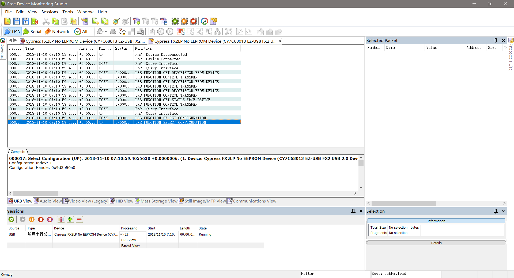
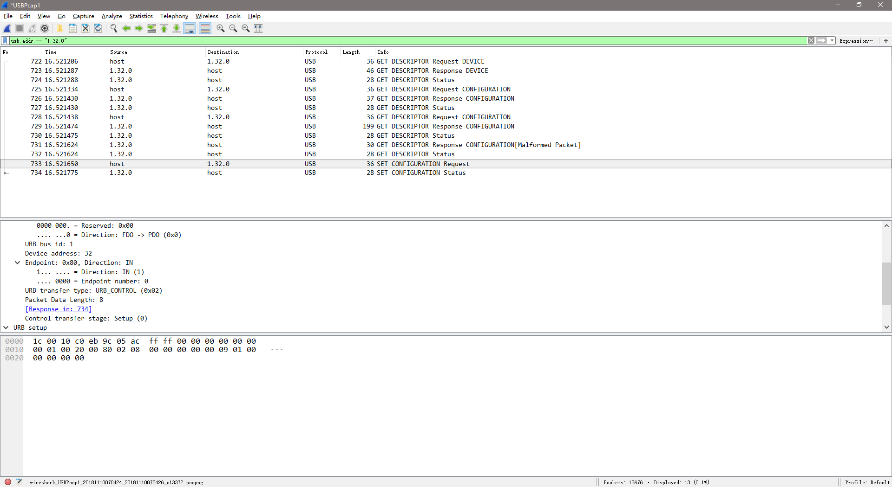

# Capturing USB Traffic

## 参考文档

* [USB枚举过程详细分析](https://wenku.baidu.com/view/ffa4f33a227916888486d7a4.html)
* [wireshark usb traces explanations](https://superuser.com/questions/873896/wireshark-usb-traces-explanations)
* [USB Request Blocks (URBs)](https://docs.microsoft.com/en-us/windows-hardware/drivers/usbcon/communicating-with-a-usb-device)

## Free USB Analyzer

* Download：https://freeusbanalyzer.com/

## Wireshark

Download：https://www.wireshark.org/download.html

**Note**：安装的时候要选择安装USB支持包，默认不安装USB支持包

## 枚举流程分析

* USB枚举阶段分三个过程：
  * 获取设备描述符；
  * 设置地址；
  * 获取所有描述符；
* 从目前的抓包工具获取的数据来看，能抓到的都是第三个阶段的数据，前面两个阶段的数据目前貌似无法通过工具获取到；

## URB(USB Request Block)

* A USB URB is like an IP packet and a USB endpoint is like an IP port. USB endpoints 0x00-0x7F are on the host, and the endpoints 0x80-0xFF are on the device. Therefore, the endpoint encodes the direction of the transfer;
* 一个urb包含了执行usb传输所需要的所有信息。当要进行数据传输时，需要分配一个urb结构体，对其进行初始化，然后将其提交给usb核心。USB核心对urb进行解析，将控制信息提交给主机控制器，由主机控制器负责数据到设备的传输。这时，驱动程序只需等待，当数据回传到主机控制器后，会转发给USB核心，唤醒等待的驱动程序，由驱动程序完成剩下的工作；
* 一个URB相当于一次USB总线实际数据传输，不过在设备总，能看到的不过是中断/IN/OUT端点数据；
