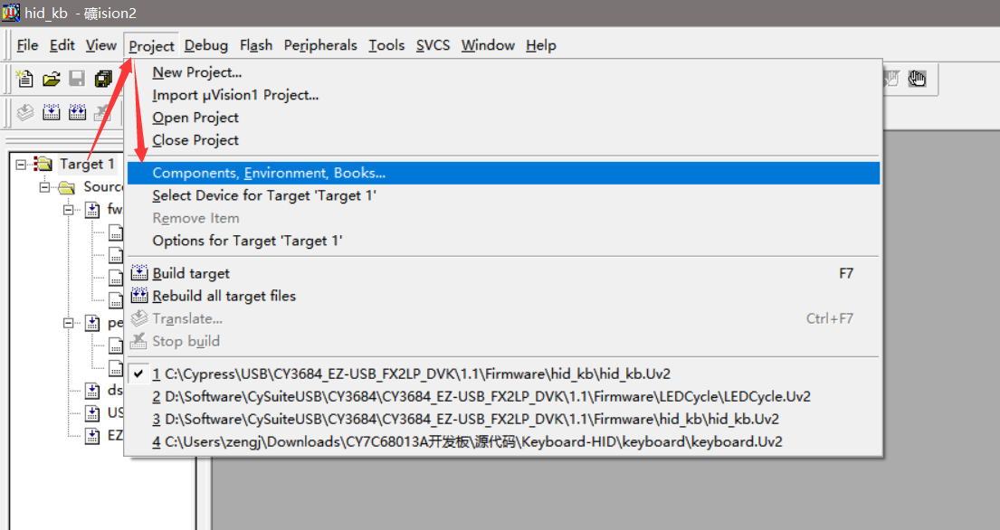

# CY3684 EZ-USB FX2LP DVK

配置Firmware开发环境，使用Keil UV2进行开发，不过需要配置环境才能使用，而不是安装完成了直接能够使用，目前是在Windows 10上进行配置环境是OK，说明在Windows 10上可以正常工作。

## Download

[CY3684 EZ-USB FX2LP DVK Setup (Kit Design Files, Kiel IDE,GPIF Designer, Host applications, Documentation, Examples)](http://www.cypress.com/file/135301)

安装的时候貌似如果选了C盘的话，Keil会需要指定路径，如果不是C盘，不需要指定的样子；

## 参考文档

* Firmware Readme（根据自己的安装目录查看）：`C:\Cypress\USB\CY3684_EZ-USB_FX2LP_DVK\1.1\Firmware\Readme.txt`

## 配置Keil Firmware开发环境

* 选择配置项目环境：
  
* 配置项目环境及编译输出：
  

