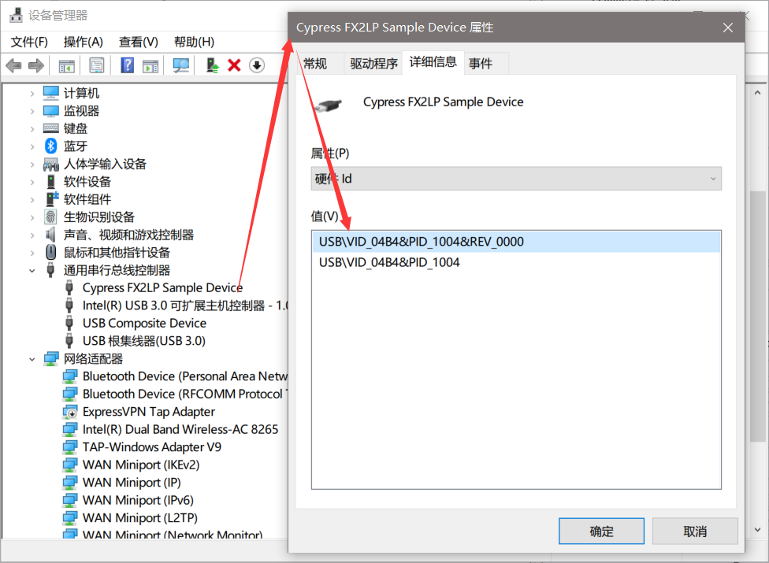
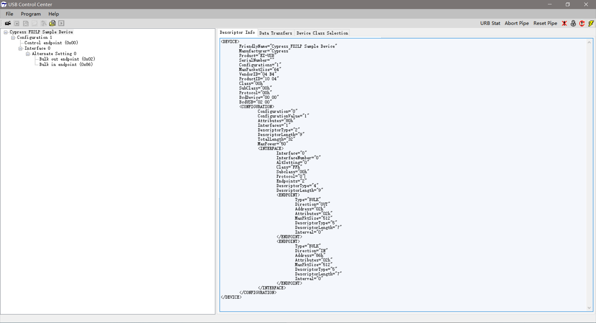
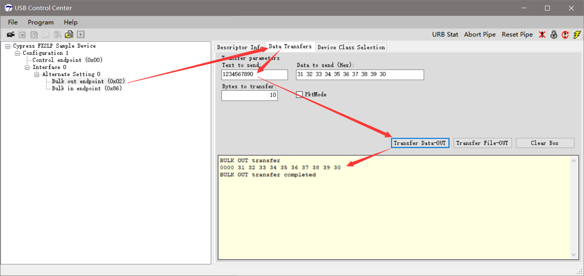
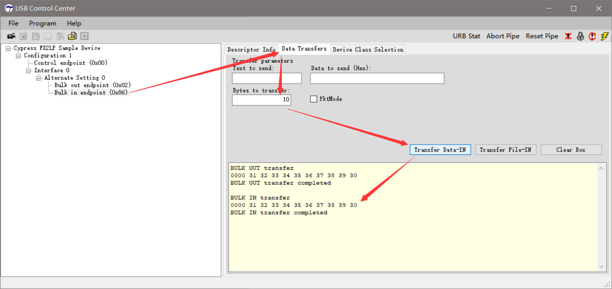
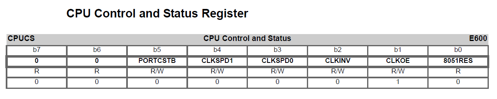
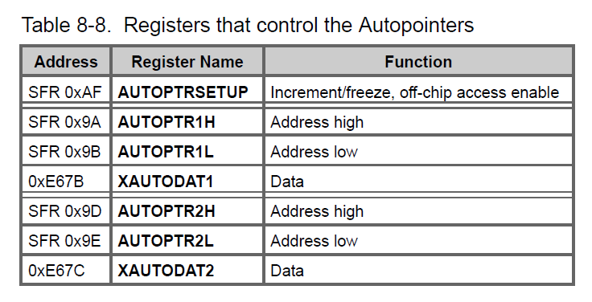

# Bulkloop Example

## Code Position

代码位置（根据自己的安装目录查看）：`C:\Cypress\USB\CY3684_EZ-USB_FX2LP_DVK\1.1\Firmware\Bulkloop`

## 参考文档

* 文档位置（根据自己的安装目录查看）：`C:\Cypress\USB\CY3684_EZ-USB_FX2LP_DVK\1.1\Documentation\EZ-USB(R) Development Kit User Guide.pdf`
* [Getting Start with example Bulkloop fail](https://community.cypress.com/thread/13140): To avoid this problem, the following two lines implemented in the firmware must be commented out.
  ```C
  EZUSB_WriteI2C(LED_ADDR, 0x01, &(Digit[AlternateSetting]));
  EZUSB_WaitForEEPROMWrite(LED_ADDR);
  ```
* [Absolute Variable Location](http://www.keil.com/support/man/docs/c51/c51_le_absvarloc.htm)
* [EZ-USB® FX2LP™中的中断处理](https://www.cypress.com/file/202956/download)

## 修改源代码

* `C:\Cypress\USB\CY3684_EZ-USB_FX2LP_DVK\1.1\Firmware\Bulkloop\Fx2.h`：不知道为什么Keil编辑器里打不开，要另外用文本编辑器打开
  ```C
  [...省略]
  // #define ENABLE_7_SEG_DISPLAY
  extern int start_7_seg_display;  
  [...省略]
  ```

## Device Bulkloop Test

* 设备管理器查看设备  
    
* 查看设备枚举信息  
  
* Bulk Out
  
* Bulk In
  

## 设备描述符dscr.a51

* Descriptor Info
  ```XML
  <DEVICE>
      FriendlyName="Cypress FX2LP Sample Device"
      Manufacturer="Cypress"
      Product="EZ-USB"
      SerialNumber=""
      Configurations="1"
      MaxPacketSize="64"
      VendorID="04 B4"
      ProductID="10 04"
      Class="00h"
      SubClass="00h"
      Protocol="00h"
      BcdDevice="00 00"
      BcdUSB="02 00"
      <CONFIGURATION>
          Configuration="0"
          ConfigurationValue="1"
          Attributes="80h"
          Interfaces="1"
          DescriptorType="2"
          DescriptorLength="9"
          TotalLength="32"
          MaxPower="50"
          <INTERFACE>
              Interface="0"
              InterfaceNumber="0"
              AltSetting="0"
              Class="FFh"
              Subclass="00h"
              Protocol="0"
              Endpoints="2"
              DescriptorType="4"
              DescriptorLength="9"
              <ENDPOINT>
                  Type="BULK"
                  Direction="OUT"
                  Address="02h"
                  Attributes="02h"
                  MaxPktSize="512"
                  DescriptorType="5"
                  DescriptorLength="7"
                  Interval="0"
              </ENDPOINT>
              <ENDPOINT>
                  Type="BULK"
                  Direction="IN"
                  Address="86h"
                  Attributes="02h"
                  MaxPktSize="512"
                  DescriptorType="5"
                  DescriptorLength="7"
                  Interval="0"
              </ENDPOINT>
          </INTERFACE>
      </CONFIGURATION>
  </DEVICE>
  ```
* Source Code
  ```ASM
  ;;-----------------------------------------------------------------------------
  ;;   File:      dscr.a51
  ;;   Contents:  This file contains descriptor data tables.
  ;;
  ;; $Archive: /USB/Examples/Fx2lp/bulkloop/dscr.a51 $
  ;; $Date: 9/01/03 8:51p $
  ;; $Revision: 3 $
  ;;
  ;;
  ;;-----------------------------------------------------------------------------
  ;; Copyright 2003, Cypress Semiconductor Corporation
  ;;-----------------------------------------------------------------------------;;-----------------------------------------------------------------------------
     
  ;; 相当于是宏定义
  DSCR_DEVICE   equ   1   ;; Descriptor type: Device
  DSCR_CONFIG   equ   2   ;; Descriptor type: Configuration
  DSCR_STRING   equ   3   ;; Descriptor type: String
  DSCR_INTRFC   equ   4   ;; Descriptor type: Interface
  DSCR_ENDPNT   equ   5   ;; Descriptor type: Endpoint
  DSCR_DEVQUAL  equ   6   ;; Descriptor type: Device Qualifier
  
  DSCR_DEVICE_LEN   equ   18
  DSCR_CONFIG_LEN   equ    9
  DSCR_INTRFC_LEN   equ    9
  DSCR_ENDPNT_LEN   equ    7
  DSCR_DEVQUAL_LEN  equ   10
  
  ET_CONTROL   equ   0   ;; Endpoint type: Control
  ET_ISO       equ   1   ;; Endpoint type: Isochronous
  ET_BULK      equ   2   ;; Endpoint type: Bulk
  ET_INT       equ   3   ;; Endpoint type: Interrupt
  
  public      DeviceDscr, DeviceQualDscr, HighSpeedConfigDscr, FullSpeedConfigDscr, StringDscr, UserDscr
  
  DSCR   SEGMENT   CODE PAGE
  
  ;;-----------------------------------------------------------------------------
  ;; Global Variables
  ;;-----------------------------------------------------------------------------
        rseg DSCR      ;; locate the descriptor table in on-part memory.
  
  ;; db/dw解释
  ;;     http://www.keil.com/support/man/docs/a51/a51_st_db.htm
  DeviceDscr:   
        db   DSCR_DEVICE_LEN      ;; Descriptor length
        db   DSCR_DEVICE   ;; Decriptor type
        dw   0002H      ;; Specification Version (BCD)
        db   00H        ;; Device class
        db   00H         ;; Device sub-class
        db   00H         ;; Device sub-sub-class
        db   64         ;; Maximum packet size
        dw   0B404H      ;; Vendor ID
        dw   0410H      ;; Product ID (Sample Device)
        dw   0000H      ;; Product version ID
        db   1         ;; Manufacturer string index
        db   2         ;; Product string index
        db   0         ;; Serial number string index
        db   1         ;; Number of configurations
  
  DeviceQualDscr:
        db   DSCR_DEVQUAL_LEN   ;; Descriptor length
        db   DSCR_DEVQUAL   ;; Decriptor type
        dw   0002H      ;; Specification Version (BCD)
        db   00H        ;; Device class
        db   00H         ;; Device sub-class
        db   00H         ;; Device sub-sub-class
        db   64         ;; Maximum packet size
        db   1         ;; Number of configurations
        db   0         ;; Reserved
  
  HighSpeedConfigDscr:   
        db   DSCR_CONFIG_LEN               ;; Descriptor length
        db   DSCR_CONFIG                  ;; Descriptor type
        db   (HighSpeedConfigDscrEnd-HighSpeedConfigDscr) mod 256 ;; Total Length (LSB)
        db   (HighSpeedConfigDscrEnd-HighSpeedConfigDscr)  /  256 ;; Total Length (MSB)
        db   1      ;; Number of interfaces
        db   1      ;; Configuration number
        db   0      ;; Configuration string
        db   10000000b   ;; Attributes (b7 - buspwr, b6 - selfpwr, b5 - rwu)
        db   50      ;; Power requirement (div 2 ma)
  
  ;; Interface Descriptor
        db   DSCR_INTRFC_LEN      ;; Descriptor length
        db   DSCR_INTRFC         ;; Descriptor type
        db   0               ;; Zero-based index of this interface
        db   0               ;; Alternate setting
        db   2               ;; Number of end points 
        db   0ffH            ;; Interface class
        db   00H               ;; Interface sub class
        db   00H               ;; Interface sub sub class
        db   0               ;; Interface descriptor string index
        
  ;; Endpoint Descriptor
        db   DSCR_ENDPNT_LEN      ;; Descriptor length
        db   DSCR_ENDPNT         ;; Descriptor type
        db   02H               ;; Endpoint number, and direction
        db   ET_BULK            ;; Endpoint type
        db   00H               ;; Maximun packet size (LSB)
        db   02H               ;; Max packect size (MSB)
        db   00H               ;; Polling interval
  
  ;; Endpoint Descriptor
        db   DSCR_ENDPNT_LEN      ;; Descriptor length
        db   DSCR_ENDPNT         ;; Descriptor type
        db   86H               ;; Endpoint number, and direction
        db   ET_BULK            ;; Endpoint type
        db   00H               ;; Maximun packet size (LSB)
        db   02H               ;; Max packect size (MSB)
        db   00H               ;; Polling interval
  
  HighSpeedConfigDscrEnd:   
  
  FullSpeedConfigDscr:   
        db   DSCR_CONFIG_LEN               ;; Descriptor length
        db   DSCR_CONFIG                  ;; Descriptor type
        db   (FullSpeedConfigDscrEnd-FullSpeedConfigDscr) mod 256 ;; Total Length (LSB)
        db   (FullSpeedConfigDscrEnd-FullSpeedConfigDscr)  /  256 ;; Total Length (MSB)
        db   1      ;; Number of interfaces
        db   1      ;; Configuration number
        db   0      ;; Configuration string
        db   10000000b   ;; Attributes (b7 - buspwr, b6 - selfpwr, b5 - rwu)
        db   50      ;; Power requirement (div 2 ma)
  
  ;; Interface Descriptor
        db   DSCR_INTRFC_LEN      ;; Descriptor length
        db   DSCR_INTRFC         ;; Descriptor type
        db   0               ;; Zero-based index of this interface
        db   0               ;; Alternate setting
        db   2               ;; Number of end points 
        db   0ffH            ;; Interface class
        db   00H               ;; Interface sub class
        db   00H               ;; Interface sub sub class
        db   0               ;; Interface descriptor string index
        
  ;; Endpoint Descriptor
        db   DSCR_ENDPNT_LEN      ;; Descriptor length
        db   DSCR_ENDPNT         ;; Descriptor type
        db   02H               ;; Endpoint number, and direction
        db   ET_BULK            ;; Endpoint type
        db   40H               ;; Maximun packet size (LSB)
        db   00H               ;; Max packect size (MSB)
        db   00H               ;; Polling interval
  
  ;; Endpoint Descriptor
        db   DSCR_ENDPNT_LEN      ;; Descriptor length
        db   DSCR_ENDPNT         ;; Descriptor type
        db   86H               ;; Endpoint number, and direction
        db   ET_BULK            ;; Endpoint type
        db   40H               ;; Maximun packet size (LSB)
        db   00H               ;; Max packect size (MSB)
        db   00H               ;; Polling interval
  
  FullSpeedConfigDscrEnd:   
  
  StringDscr:
  
  StringDscr0:   
        db   StringDscr0End-StringDscr0      ;; String descriptor length
        db   DSCR_STRING
        db   09H,04H
  StringDscr0End:
  
  StringDscr1:   
        db   StringDscr1End-StringDscr1      ;; String descriptor length
        db   DSCR_STRING
        db   'C',00
        db   'y',00
        db   'p',00
        db   'r',00
        db   'e',00
        db   's',00
        db   's',00
  StringDscr1End:
  
  StringDscr2:   
        db   StringDscr2End-StringDscr2      ;; Descriptor length
        db   DSCR_STRING
        db   'E',00
        db   'Z',00
        db   '-',00
        db   'U',00
        db   'S',00
        db   'B',00
  StringDscr2End:
  
  UserDscr:      
        dw   0000H
        end
        
  ```

## 寄存器定义头文件

* 代码位置（根据自己的安装目录查看）：`C:\Cypress\USB\CY3684_EZ-USB_FX2LP_DVK\1.1\Target\Inc\fx2regs.h`
* 寄存器定义说明：[Absolute Variable Location](http://www.keil.com/support/man/docs/c51/c51_le_absvarloc.htm)
* `volatile`用于防止相关变量被优化，防止编译器对寄存器读写操作优化导致数据写入过程被忽略。
* 示例 CPUCS寄存器：  
  
  ```C
  [...省略]
  EXTERN xdata volatile BYTE CPUCS             _AT_ 0xE600;  // Control & Status
  [...省略]
  /* CPU Control & Status Register (CPUCS) */
  #define bmPRTCSTB    bmBIT5
  #define bmCLKSPD     (bmBIT4 | bmBIT3)
  #define bmCLKSPD1    bmBIT4
  #define bmCLKSPD0    bmBIT3
  #define bmCLKINV     bmBIT2
  #define bmCLKOE      bmBIT1
  #define bm8051RES    bmBIT0
  [...省略]
  ```

## Autopointers

* 《EZ-USB(R) Technical Reference Manual.pdf》 —— 8.8 Autopointers(Page 96)



## Bulkloop

```C
[...省略]
//-----------------------------------------------------------------------------
// Task Dispatcher hooks
//   The following hooks are called by the task dispatcher.
//-----------------------------------------------------------------------------

void TD_Init(void)             // Called once at startup
{
   BYTE dum;                    // For the LEDS
   CPUCS = ((CPUCS & ~bmCLKSPD) | bmCLKSPD1) ;    // 48 MHz CPU clock
   
   
   // Turn off all 4 LEDS
   dum = D2OFF;
   dum = D3OFF;
   dum = D4OFF;
   dum = D5OFF;

// EP2CFG & EP6CFG configure our two endpoints, EP2-OUT and EP6-IN
// b7:        Valid
// b6:        DIR (0=OUT, 1=IN)
// b[5:4]    Type (01=ISO, 10=BULK, 11=INT)
// b3:        Size (0=512, 1=1024 bytes)
// b2:        0
// b[1:0]    Buffering (00=quad, 10=double, 11=triple)        
//

  EP2CFG = 0xA2;    // Valid, BULK-OUT, 512 byte buffer, double-buffered
  SYNCDELAY;        // Some regs take longer to update, see TRM Section 15.14.                    
  EP6CFG = 0xE2;    // Valid, BULK-IN, 512 byte buffer, double-buffered
  SYNCDELAY;                    

  // OUT endpoints do not come up armed
  // Since the endpoint is double buffered we must write dummy byte counts twice
  EP2BCL = 0x80;      // arm EP2OUT by writing byte count w/skip.
  SYNCDELAY;                    
  EP2BCL = 0x80;    // again
  SYNCDELAY;                    
  // enable dual autopointer feature
  AUTOPTRSETUP |= 0x01;

  USBIE |= bmSOF;                // Enable the SOF IRQ to serve as LED timers
  EPIE = bmEP6IRQ | bmEP2IRQ;    // Enable EP6 and EP2 Interrupts to turn on transfer LEDS
}

void TD_Poll(void)              // Called repeatedly while the device is idle
{
  WORD i;
  WORD count;
//  BYTE dummy_LED2;        // ***For the LED
  BYTE waiting_inpkts;

#ifdef ENABLE_7_SEG_DISPLAY
if(start_7_seg_display)
{
// update 7-seg readout with number of IN packets waiting for transfer to the host
  waiting_inpkts = (EP6CS & 0xF0)>>4;
  EZUSB_WriteI2C(LED_ADDR, 0x01, &(Digit[waiting_inpkts]));
  EZUSB_WaitForEEPROMWrite(LED_ADDR);
}
#endif

// Transfer EP6-OUT buffer to EP2-IN buffer when there is a packet in one of the EP6-OUT buffers, AND
// there is an available EP2-IN buffer. The FIFO status flags update after full packets are transferred.
// Therefore EP2-OUT "Not Empty" means a packet is available, and "EP6-IN "Not Full" means there is an
// available buffer. Using the flags this way handles any packet size and takes multiple buffering
// into account.   

    if(!(EP2468STAT & bmEP2EMPTY))        // Is EP2-OUT buffer not empty (has at least one packet)?
    {
        if(!(EP2468STAT & bmEP6FULL))    // YES: Is EP6-IN buffer not full (room for at least 1 pkt)?
         { 
        /*
        #define AUTOPTR1H AUTOPTRH1 // for backwards compatibility with examples
        #define AUTOPTR1L AUTOPTRL1 // for backwards compatibility with examples
        #define APTR1H AUTOPTRH1 // for backwards compatibility with examples
        #define APTR1L AUTOPTRL1 // for backwards compatibility with examples
            
        // this is how they are defined in the TRM
        sfr AUTOPTRH1     = 0x9A; 
        sfr AUTOPTRL1     = 0x9B; 
        sfr AUTOPTRH2     = 0x9D;
        sfr AUTOPTRL2     = 0x9E; 
        */
        APTR1H = MSB( &EP2FIFOBUF );
        APTR1L = LSB( &EP2FIFOBUF );
        AUTOPTRH2 = MSB( &EP6FIFOBUF );
        AUTOPTRL2 = LSB( &EP6FIFOBUF );

        count = (EP2BCH << 8) + EP2BCL;

        // loop EP2OUT buffer data to EP6IN
        for( i = 0; i < count; i++ )
        {
            /*
            EXTERN xdata volatile BYTE XAUTODAT1         _AT_ 0xE67B;  // Autoptr1 MOVX access
            EXTERN xdata volatile BYTE XAUTODAT2         _AT_ 0xE67C;  // Autoptr2 MOVX access

            #define EXTAUTODAT1 XAUTODAT1
            #define EXTAUTODAT2 XAUTODAT2
            */
            EXTAUTODAT2 = EXTAUTODAT1;    // Autopointers make block transfers easy...
        }
        EP6BCH = EP2BCH;        // Send the same number of bytes as received  
        SYNCDELAY;  
        EP6BCL = EP2BCL;        // arm EP6IN
        SYNCDELAY;                    
        EP2BCL = 0x80;          // arm EP2OUT
     }
  }
}
```

