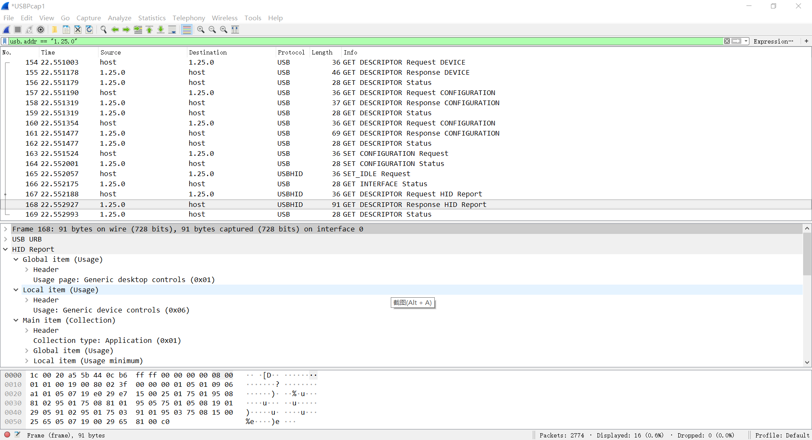
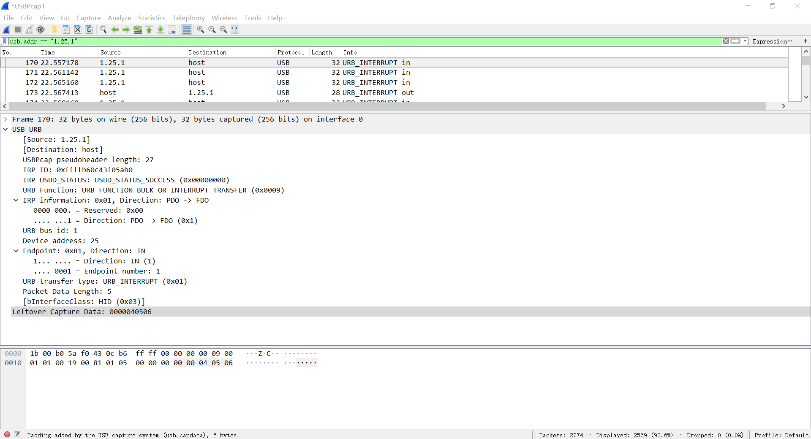
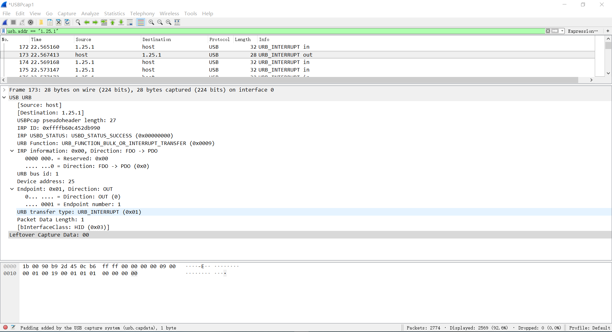

# HID Keyboard

键盘的描述符共有8字节的输入报告和1字节的输出报告:
  * 8字节输入报告：第1字节特殊按键，第2字节保留常量，第3-8字节普通按键。键值可以参考USB HID to PS/2 Scan Code Translation Table.
  * 1字节输出报告：这1个字节总共用了5bits使用3bits常量来补足成1个字节。5bits用来点亮特殊键盘上的Led灯，比如键盘的大小写，数字键，小键盘的LED灯。
  * 如果不给键盘配置OUT端点，那么键盘的1字节输出报告将由控制端点的SetReport进行传输。

## 参考文档

* [./refers/USB_HID_Keyboard_Firmware.pdf](./refers/USB_HID_Keyboard_Firmware.pdf)
* [Tutorial about USB HID Report Descriptors](https://eleccelerator.com/tutorial-about-usb-hid-report-descriptors/)
* [关于USBHID协议以及鼠标键盘描述符的解释](https://blog.csdn.net/jiujiujiuqiuqiuqiu/article/details/47277685)

## 报告描述符生成器

[HID Descriptor Tool](https://www.usb.org/document-library/hid-descriptor-tool)

## Code Positon

`C:\Cypress\USB\CY3684_EZ-USB_FX2LP_DVK\1.1\Firmware\hid_kb`

## HID 报告描述符

```ASM
HIDReportDscr:
    ; 通用桌面键盘
    db 05h, 01h    ;    Usage Page (Generic Desktop)
    db 09h, 06h    ;    Usage (Keyboard)
    db 0A1h, 01h   ;    Collection (Application)

    ; 按键值类型，输入，占用8bit * 1
    db 05h, 07h    ;    Usage Page (Key codes)
    db 19h, 0E0h   ;    Usage minimum (224)
    db 29h, 0E7h   ;    Usage maximum (231)
    db 15h, 00h    ;    Logical minimum (0)
    db 25h, 01h    ;    Logical maximum (1)
    db 75h, 01h    ;    Report size (1)
    db 95h, 08h    ;    Report count (8)
    db 81h, 02h    ;    Input (data, variable, absolute)

    ; 常量，也就是保留，占用8bit * 1
    db 95h, 01h    ;    Report count (1)
    db 75h, 08h    ;    Report size (8)
    db 81h, 01h    ;    Input (constant)

    ; 灯类型，输出，占用1bit * 5
    db 95h, 05h    ;    Report count (5)
    db 75h, 01h    ;    Report size (1)
    db 05h, 08h    ;    Usage Page (LED)
    db 19h, 01h    ;    Usage minimum (1)
    db 29h, 05h    ;    Usage maximum (5)
    db 91h, 02h    ;    Output (data, variable, absolute)

    ; 常量，也就是保留，占用3bit * 1，填充前面的5bit，达到8bit
    db 95h, 01h    ;    Report count (1)
    db 75h, 03h    ;    Report size (3)
    db 91h, 01h    ;    Output (constant)

    ; 按键值类型，输入，占用8bit * 3
    db 95h, 03h    ;    Report count (3)
    db 75h, 08h    ;    Report size (8)
    db 15h, 00h    ;    Logical minimum (0)         每个字节的取值范围是 0~101
    db 25h, 65h    ;    Logical maximum (101)       
    db 05h, 07h    ;    Usage page (key codes)
    db 19h, 00h    ;    Usage minimum (0)           分别是键盘码 0~键盘码 101
    db 29h, 65h    ;    Usage maximum (101)         
    db 81h, 00h    ;    Input (data, array)
    db 0C0h        ;    End Collection
HIDReportDscrEnd:
```

## HID Keyboard

```C
[...省略]
void TD_Init(void)             // Called once at startup
{
   leds = 0xFF;
   oldbuttons = 0xFF;

   EP1OUTCFG = 0xB0;       // valid, interrupt
   EP1INCFG = 0XB0;        // valid, interrupt

   EP2CFG = EP4CFG = EP6CFG = EP8CFG = 0;   // disable unused endpoints

    // EZUSB_InitI2C();            // Initialize EZ-USB I2C controller


}

void TD_Poll(void)             // Called repeatedly while the device is idle
{
   if( !(EP1INCS & bmEPBUSY) )    // Is the IN1BUF available; 八字节的输入报文
   {
      // EZUSB_ReadI2C(BTN_ADDR,0x01,&buttons);    // Read button states
      buttons = 0x01;
      // buttons &= 0x0F;
      // if ((oldbuttons - buttons) != 0)    //Change in button state
      if ((buttons) != 0)    //Change in button state
      {
         if (buttons & 1)    //Shift
            EP1INBUF[0] = 0;
         else
            EP1INBUF[0] = 2;

         if (buttons & 2)    //a
            EP1INBUF[2] = 0;
         else
            EP1INBUF[2] = 4;

         if (buttons & 4)    //b
            EP1INBUF[3] = 0;
         else
            EP1INBUF[3] = 5;

         if (buttons & 8)    //c
            EP1INBUF[4] = 0;
         else
            EP1INBUF[4] = 6;

            EP1INBUF[1] = 0;
            EP1INBC = 5;
      }
      // oldbuttons = buttons;
   }

    if( !(EP1OUTCS & bmEPBUSY) )    // Is there something available; 1字节的输出报文
    {
        leds = 0xFF;            //Turn all off

        if (EP1OUTBUF[0] & 0x02)    //Caps
            leds &= 0xBF;
        if (EP1OUTBUF[0] & 0x01)    //Scroll
            leds &= 0xF7;
        if (EP1OUTBUF[0] & 0x04)    //Num
            leds &= 0xFE;

      // EZUSB_WriteI2C(LED_ADDR, 0x01, &leds);
      // EZUSB_WaitForEEPROMWrite(LED_ADDR);

        EP1OUTBC = 0;                //Rearm endpoint buffer
    }
}

[...省略]
//-----------------------------------------------------------------------------
// Device Request hooks
//   The following hooks are called by the end point 0 device request parser.
//-----------------------------------------------------------------------------

BOOL DR_GetDescriptor(void)
{
    BYTE length,i;

    pHIDDscr = (WORD)&HIDDscr;
    pReportDscr = (WORD)&HIDReportDscr;
    pReportDscrEnd = (WORD)&HIDReportDscrEnd;

    switch (SETUPDAT[3])
    {
        case GD_HID:                    //HID Descriptor
            SUDPTRH = MSB(pHIDDscr);
            SUDPTRL = LSB(pHIDDscr);
            return (FALSE);
        case GD_REPORT:                    //Report Descriptor
            length = pReportDscrEnd - pReportDscr;

         AUTOPTR1H = MSB(pReportDscr);
         AUTOPTR1L = LSB(pReportDscr);

         for(i=0;i<length;i++)
            EP0BUF[i]=XAUTODAT1;

         EP0BCL = length;
         return (FALSE);
        default:
            return(TRUE);
    }
}
[...省略]
```

## Wireshark Capture

* Enumerate
  
* Interrupt IN
  
* Interrupt Out
  
