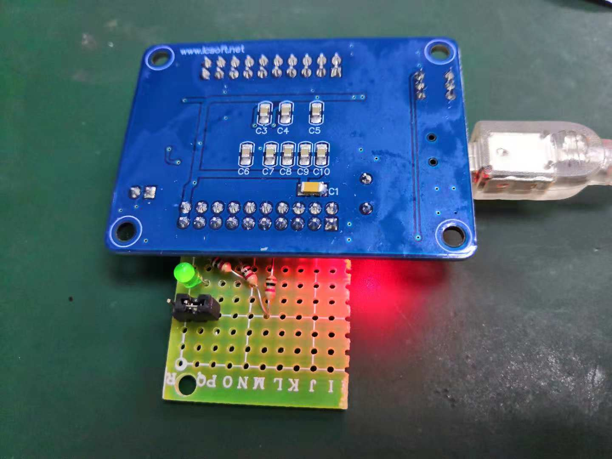
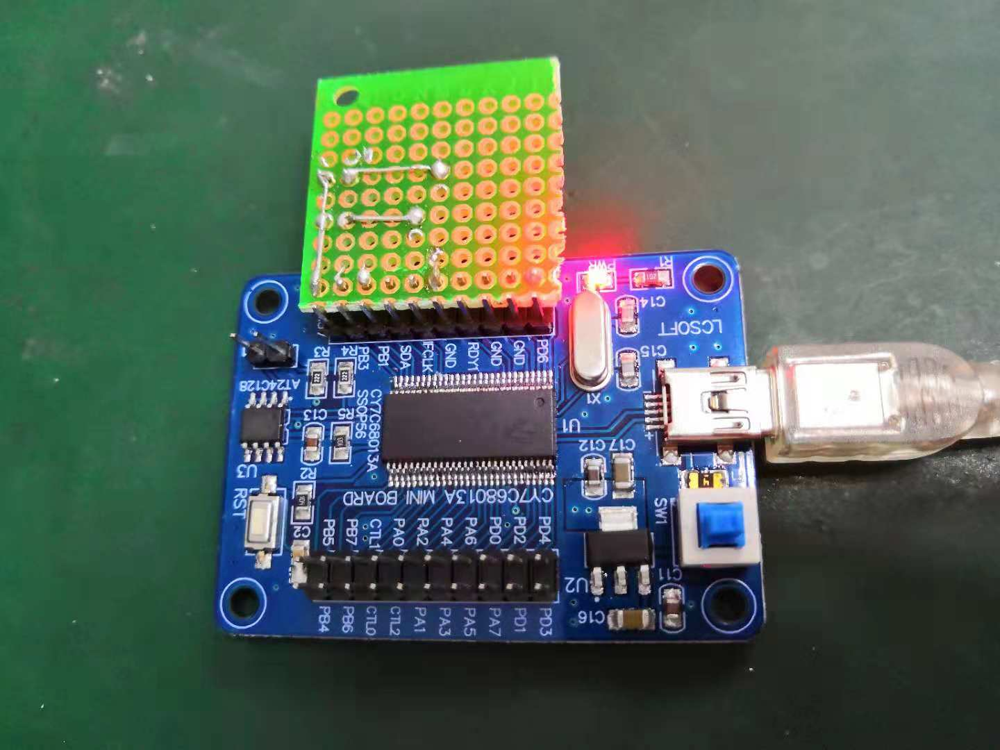
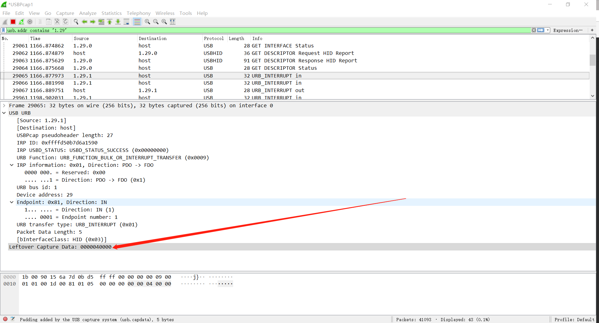

# HID Keyboard Modify

USB控制器会采用伪中断进行对设备进行轮询，Wireshare只有在有数据传输才会在总线上有Interrupt IN包，也就是说如果设备没有准备好数据，那么USB控制器是不会去轮询的。

## Hardware Modify

* `PB0`引脚接一个插件跳冒，因为没找到按钮，用跳冒来模拟按键按下；
* `PB2`引脚用于点亮灯，用于指示一些信息；




## Code Example

```C
[...省略]
#define KEY_DOWN            0x01
#define KEY_UP              0x02

//-----------------------------------------------------------------------------
// Task Dispatcher hooks
//   The following hooks are called by the task dispatcher.
//-----------------------------------------------------------------------------

void TD_Init(void)                          // Called once at startup
{
    leds = 0xFF;
    oldbuttons = 0xFF;
    keyStatus = KEY_UP;                     // current key status

    EP1OUTCFG = 0xB0;                       // valid, interrupt
    EP1INCFG = 0XB0;                        // valid, interrupt

    EP2CFG = EP4CFG = EP6CFG = EP8CFG = 0;  // disable unused endpoints
    
    OEB = 0x04;
    IOB = 0x00;

    // init button status
    buttons = IOB;
    buttons &= 0x01;
    oldbuttons = buttons;
}

void TD_Poll(void)                          // Called repeatedly while the device is idle
{
    if( !(EP1INCS & bmEPBUSY) )    // Is the IN1BUF available,
    {
        buttons = PB0;
        buttons &= 0x01;
        if (((oldbuttons - buttons) != 0) && (keyStatus == KEY_UP) && (PB0 == 1))    //Change in button state
        {
            EP1INBUF[2] = 4;

            EP1INBUF[0] = 0;
            EP1INBUF[1] = 0;
            EP1INBUF[3] = 0;
            EP1INBUF[4] = 0;
            EP1INBC = 5;

            keyStatus = KEY_DOWN;
        } else if (((oldbuttons - buttons) == 0) && (keyStatus == KEY_DOWN) && (PB0 == 0)){
            EP1INBUF[2] = 0;

            EP1INBUF[0] = 0;
            EP1INBUF[1] = 0;
            EP1INBUF[3] = 0;
            EP1INBUF[4] = 0;
            EP1INBC = 5;
             
            keyStatus = KEY_UP;
        }
        oldbuttons = buttons;
    }

    if( !(EP1OUTCS & bmEPBUSY) )    // Is there something available
    {
        PB2 = ~PB2;

        EP1OUTBC = 0;                //Rearm endpoint buffer
    }
}
[...省略]
```

## Wireshark Capture


