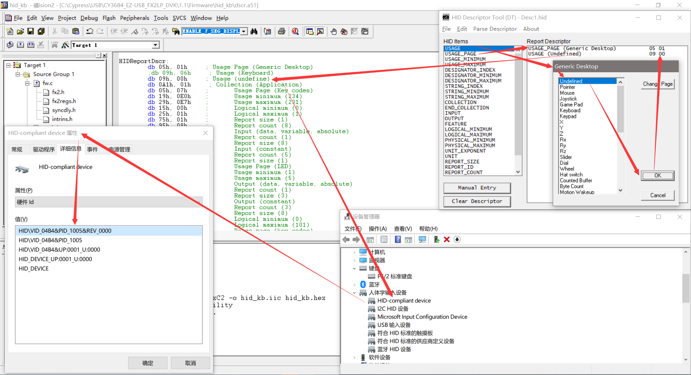
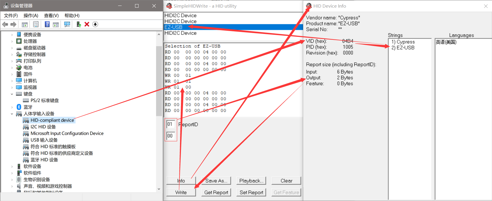
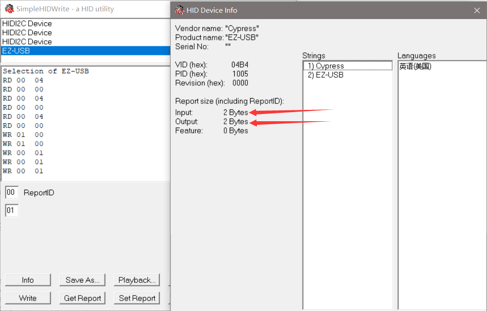
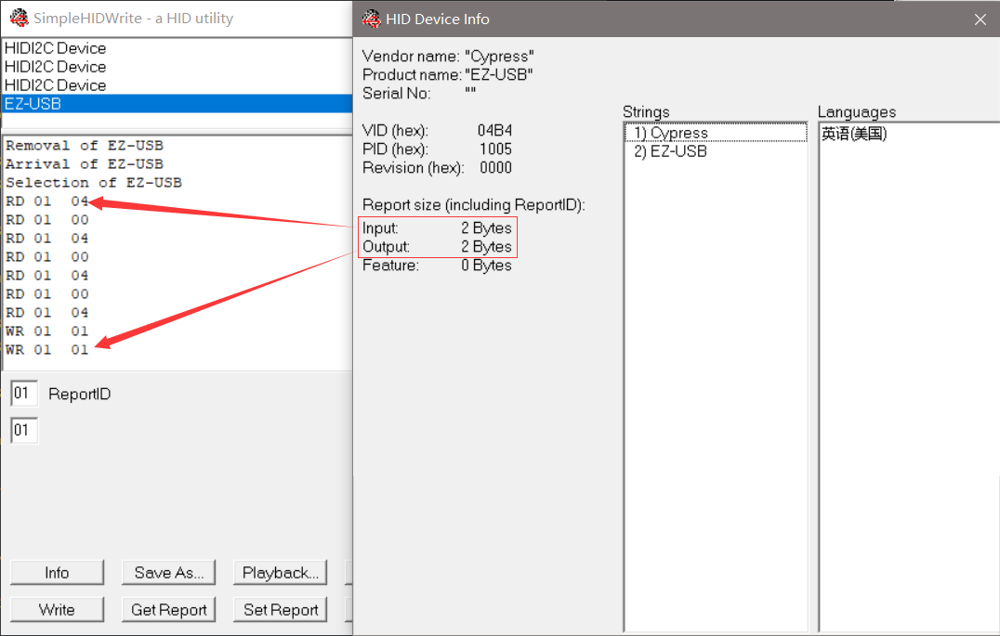

# HID Compliant Deivce

## 参考文档

* [USB HID sniffer – Software (windows)](http://domoticx.com/usb-hid-sniffer-software-windows/)
  * Download 1: https://github.com/downloads/bbeardsley/BuzzIO/SimpleHIDWrite3.zip
  * Download 2: [SimpleHIDWrite3.zip](./refers/SimpleHIDWrite3.zip)
* [Tutorial about USB HID Report Descriptors](https://eleccelerator.com/tutorial-about-usb-hid-report-descriptors/): 需要理解Report id，可以主要看Report id要怎么操作；

## Modify Keyboard to Unknow Device

* 仅将HID Keyboard声明改成HID Unknow设备：  
  ```ASM
  HIDReportDscr:
      db 05h, 01h    ;    Usage Page (Generic Desktop)
      ;db 09h, 06h   ;    Usage (Keyboard)
      db 09h, 00h    ;    Usage (undefine)
      db 0A1h, 01h   ;    Collection (Application)
      db 05h, 07h    ;    Usage Page (Key codes)
      db 19h, 0E0h   ;    Usage minimum (234)
      db 29h, 0E7h   ;    Usage maximum (231)
      db 15h, 00h    ;    Logical minimum (0)
      db 25h, 01h    ;    Logical maximum (1)
      db 75h, 01h    ;    Report size (1)
      db 95h, 08h    ;    Report count (8)
      db 81h, 02h    ;    Input (data, variable, absolute)
      db 95h, 01h    ;    Report count (1)
      db 75h, 08h    ;    Report size (8)
      db 81h, 01h    ;    Input (constant)
      db 95h, 05h    ;    Report count (5)
      db 75h, 01h    ;    Report size (1)
      db 05h, 08h    ;    Usage Page (LED)
      db 19h, 01h    ;    Usage minimum (1)
      db 29h, 05h    ;    Usage maximum (5)
      db 91h, 02h    ;    Output (data, variable, absolute)
      db 95h, 01h    ;    Report count (1)
      db 75h, 03h    ;    Report size (3)
      db 91h, 01h    ;    Output (constant)
      db 95h, 03h    ;    Report count (3)
      db 75h, 08h    ;    Report size (8)
      db 15h, 00h    ;    Logical minimum (0)
      db 25h, 65h    ;    Logical maximum (101)
      db 05h, 07h    ;    Usage page (key codes)
      db 19h, 00h    ;    Usage minimum (0)
      db 29h, 65h    ;    Usage maximum (101)
      db 81h, 00h    ;    Input (data, array)
      db 0C0h        ;    End Collection
  HIDReportDscrEnd:
  ```
  
* SimpleHIDWrite读写：
  

## Modify HID Report Dscr

* HID Report Dscr
  ```ASM
  HIDReportDscr:
      db 05h, 01h    ;    Usage Page (Generic Desktop)
      ;db 09h, 06h   ;    Usage (Keyboard)
      db 09h, 00h    ;    Usage (undefine)
      db 0A1h, 01h   ;    Collection (Application)
      db 05h, 07h    ;    Usage Page (Key codes)
      db 19h, 0E0h   ;    Usage minimum (234)
      db 29h, 0E7h   ;    Usage maximum (231)
      db 15h, 00h    ;    Logical minimum (0)
      db 25h, 01h    ;    Logical maximum (1)
      db 75h, 01h    ;    Report size (1)
      db 95h, 08h    ;    Report count (8)
      db 81h, 02h    ;    Input (data, variable, absolute)
      db 95h, 05h    ;    Report count (5)
      db 75h, 01h    ;    Report size (1)
      db 05h, 08h    ;    Usage Page (LED)
      db 19h, 01h    ;    Usage minimum (1)
      db 29h, 05h    ;    Usage maximum (5)
      db 91h, 02h    ;    Output (data, variable, absolute)
      db 95h, 01h    ;    Report count (1)
      db 75h, 03h    ;    Report size (3)
      db 91h, 01h    ;    Output (constant)
      db 0C0h        ;    End Collection
  HIDReportDscrEnd:
  ```
* Deal With Report 
  ```C
  void TD_Poll(void)             // Called repeatedly while the device is idle
  {
      if( !(EP1INCS & bmEPBUSY) )    // Is the IN1BUF available,
      {
          buttons = PB0;
          buttons &= 0x01;
          if (((oldbuttons - buttons) != 0) && (keyStatus == KEY_UP) && (PB0 == 1))    //Change in button state
          {
              EP1INBUF[0] = 4;
  
              EP1INBC = 1;
  
              keyStatus = KEY_DOWN;
          } else if (((oldbuttons - buttons) == 0) && (keyStatus == KEY_DOWN) && (PB0 == 0)){
              EP1INBUF[0] = 0;
  
              EP1INBC = 1;
                
              keyStatus = KEY_UP;
          }
          oldbuttons = buttons;
      }
  
      if( !(EP1OUTCS & bmEPBUSY) )    // Is there something available
      {
          PB2 = ~PB2;
  
          EP1OUTBC = 0;                //Rearm endpoint buffer
      }
  }
  ```
* Data Transfer
  
* 从上可知，貌似我们没有设置Report id，接下来处理一下指定Report id；

## Modify HID Report Dscr With Report ID

* HID Report Dscr
  ```ASM
  HIDReportDscr:
      db 05h, 01h    ;    Usage Page (Generic Desktop)
      ;db 09h, 06h   ;    Usage (Keyboard)
      db 09h, 00h    ;    Usage (undefine)
      db 0A1h, 01h   ;    Collection (Application)
      db 85h, 01h    ;    Report id(1)
      db 05h, 07h    ;    Usage Page (Key codes)
      db 19h, 0E0h   ;    Usage minimum (234)
      db 29h, 0E7h   ;    Usage maximum (231)
      db 15h, 00h    ;    Logical minimum (0)
      db 25h, 01h    ;    Logical maximum (1)
      db 75h, 01h    ;    Report size (1)
      db 95h, 08h    ;    Report count (8)
      db 81h, 02h    ;    Input (data, variable, absolute)
      db 95h, 05h    ;    Report count (5)
      db 75h, 01h    ;    Report size (1)
      db 05h, 08h    ;    Usage Page (LED)
      db 19h, 01h    ;    Usage minimum (1)
      db 29h, 05h    ;    Usage maximum (5)
      db 91h, 02h    ;    Output (data, variable, absolute)
      db 95h, 01h    ;    Report count (1)
      db 75h, 03h    ;    Report size (3)
      db 91h, 01h    ;    Output (constant)
      db 0C0h        ;    End Collection
  HIDReportDscrEnd:
  ```
* Deal With Report 
  ```C
  void TD_Poll(void)             // Called repeatedly while the device is idle
  {
      if( !(EP1INCS & bmEPBUSY) )   // Is the IN1BUF available,
      {
          buttons = PB0;
          buttons &= 0x01;
          if (((oldbuttons - buttons) != 0) && (keyStatus == KEY_UP) && (PB0 == 1))   //Change in button state
          {
              EP1INBUF[0] = 1;
              EP1INBUF[1] = 4;
  
              EP1INBC = 2;
  
              keyStatus = KEY_DOWN;
          } else if (((oldbuttons - buttons) == 0) && (keyStatus == KEY_DOWN) && (PB0 == 0)){
              EP1INBUF[0] = 1;
              EP1INBUF[1] = 0;
  
              EP1INBC = 2;
             
              keyStatus = KEY_UP;
          } 
          oldbuttons = buttons;
      }
  
      if( !(EP1OUTCS & bmEPBUSY) )   // Is there something available
      {
          PB2 = ~PB2;
  
          EP1OUTBC = 0;            //Rearm endpoint buffer
      }
  }
  ```
* Data Transfer
  
* 结论：
  * 如果没有设定Report id，那么第一个字节可以当作数据字节，不过系统会自动补这个字节；
  * 如果设定了Report id，那么第一个字节是Report id，后面在跟数据，Report id需要手动填写；
  * Report id相当于对数据进行分类。
