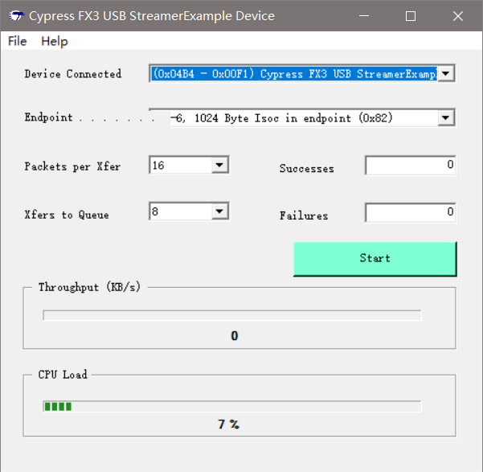

# CYStream Compile

## 错误及解决方法

* Error：
  ```
  [...省略]
  *** FATAL ERROR L250: CODE SIZE LIMIT IN RESTRICTED VERSION EXCEEDED
      MODULE:  C:\CYPRESS\KEIL\C51\LIB\C51S.LIB (-----)
      LIMIT:   1000H BYTES
  [...省略]
  ```
* 错误原因：编译的代码超过了4K的允许编译大小；
* 错误解决方向：
  * 使用全功能版Keil 2版本，买是不可能买的，破解版也不想用；
  * 精简代码，采用这个方案；
* 处理方法：
  * 去掉数码管显示代码；
  * 去掉I2C通信代码；
  * 与USB通信相关代码有全速设备和高速设备，全速设备不可能，这年代，只能是高速设备，所以去掉全速设备代码；
* 编译通过：
  ```
  [...省略]
  Program Size: data=51.5 xdata=4473 code=3994
  creating hex file from "CYStream"...
  User command #1: ..\..\Bin\hex2bix -i -f 0xC2 -o CYStream.iic CYStream.hex
  Intel Hex file to EZ-USB Binary file conversion utility
  Copyright (c) 2012-2013, Cypress Semiconductor Inc.
  4053 Bytes written.
  Total Code Bytes = 3988
  Conversion completed successfully.
  "CYStream" - 0 Error(s), 3 Warning(s).
  ```
* 设备正常识别：  
  
