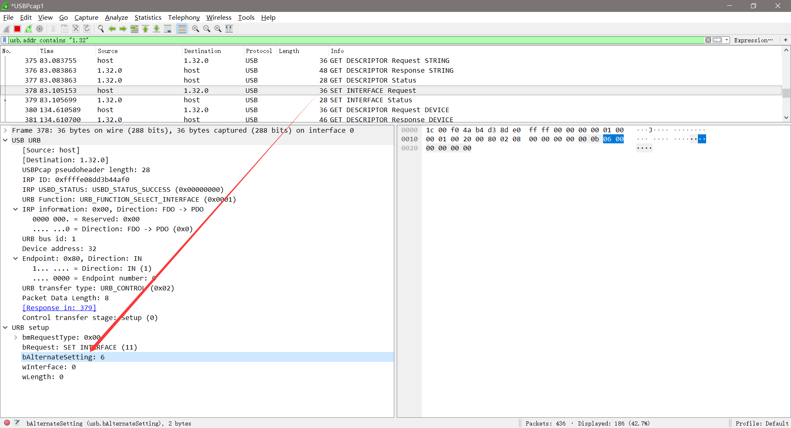
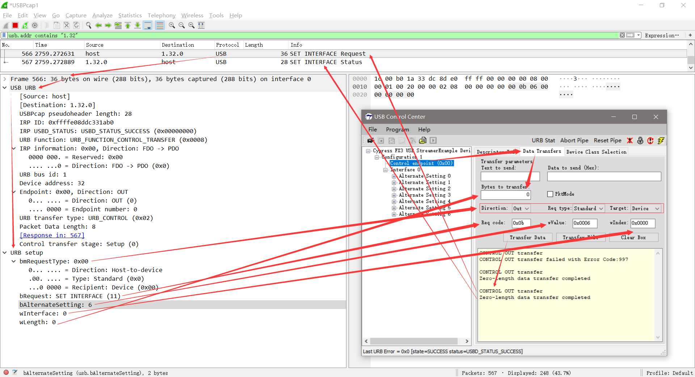

# USB Descriptors AlternateSetting

## 参考文档

* [USB Descriptors](https://www.beyondlogic.org/usbnutshell/usb5.shtml)
* [AlternateSetting](https://www.beyondlogic.org/usbnutshell/usb5.shtml#AlternateSetting)

## 总结

* 一个配置描述符中可以有多个接口，如果一个接口对应一个接口描述符，那么那个唯一的接口描述符就可以认为是接口；
* 另外同一个接口又可以有多种接口描述符，通过接口描述符中的Alternate Settings字段来区分；
* 注意上面的接口和接口描述符，接口是指接口描述符中的InterfaceNumber字段指定的索引号来确定；

## Example

一个接口中包含七种接口描述符，也就是一个接口有其中功能可以切换，在配置描述符种，也是表明只有一个接口，而不是七个。

```ASM
HighSpeedConfigDscr:   
    db   DSCR_CONFIG_LEN               ;; Descriptor length
    db   DSCR_CONFIG                  ;; Descriptor type
    db   (HighSpeedConfigDscrEnd-HighSpeedConfigDscr) mod 256 ;; Total Length (LSB)
    db   (HighSpeedConfigDscrEnd-HighSpeedConfigDscr)  /  256 ;; Total Length (MSB)
    db   1      ;; Number of interfaces
    db   1      ;; Configuration number
    db   0      ;; Configuration string
    db   10100000b   ;; Attributes (b7 - buspwr, b6 - selfpwr, b5 - rwu)
    db   50      ;; Power requirement (div 2 ma)

;; Alt Interface 0 Descriptor - Bulk IN
    db   DSCR_INTRFC_LEN   ;; Descriptor length
    db   DSCR_INTRFC       ;; Descriptor type
    db   0                 ;; Zero-based index of this interface
    db   0                 ;; Alternate setting
    db   1                 ;; Number of end points 
    db   0ffH              ;; Interface class
    db   00H               ;; Interface sub class
    db   00H               ;; Interface sub sub class
    db   0                 ;; Interface descriptor string index This would be nice to add!
    
;; Bulk IN Endpoint Descriptor
    db   DSCR_ENDPNT_LEN   ;; Descriptor length
    db   DSCR_ENDPNT       ;; Descriptor type
    db   82H               ;; Endpoint 2 and direction IN
    db   ET_BULK           ;; Endpoint type
    db   00H               ;; Maximun packet size (LSB)
    db   02H               ;; Max packect size (MSB)  512 byte packets/uFrame
    db   00H               ;; Polling interval

;; Alt Interface 1 Descriptor - Bulk OUT
    db   DSCR_INTRFC_LEN   ;; Descriptor length
    db   DSCR_INTRFC       ;; Descriptor type
    db   0                 ;; Zero-based index of this interface
    db   1                 ;; Alternate setting
    db   1                 ;; Number of end points 
    db   0ffH              ;; Interface class
    db   00H               ;; Interface sub class
    db   00H               ;; Interface sub sub class
    db   0                 ;; Interface descriptor string index This would be nice to add!
    
;; Bulk OUT Endpoint Descriptor
    db   DSCR_ENDPNT_LEN   ;; Descriptor length
    db   DSCR_ENDPNT       ;; Descriptor type
    db   2H                ;; Endpoint 2 and direction OUT
    db   ET_BULK           ;; Endpoint type
    db   00H               ;; Maximun packet size (LSB) 
    db   02H               ;; Max packect size (MSB) 512 byte packets/uFrame
    db   00H               ;; Polling interval

;; Alt Interface 2 Descriptor - Bulk IN-OUT
    db   DSCR_INTRFC_LEN   ;; Descriptor length
    db   DSCR_INTRFC       ;; Descriptor type
    db   0                 ;; Zero-based index of this interface
    db   2                 ;; Alternate setting
    db   2                 ;; Number of end points 
    db   0ffH              ;; Interface class
    db   00H               ;; Interface sub class
    db   00H               ;; Interface sub sub class
    db   0                 ;; Interface descriptor string index This would be nice to add!
    
;; Bulk IN Endpoint Descriptor
    db   DSCR_ENDPNT_LEN   ;; Descriptor length
    db   DSCR_ENDPNT       ;; Descriptor type
    db   82H               ;; Endpoint 2 and direction IN
    db   ET_BULK           ;; Endpoint type
    db   00H               ;; Maximun packet size (LSB) 512 byte packets/uFrame
    db   02H               ;; Max packect size (MSB)
    db   00H               ;; Polling interval

;; Bulk OUT Endpoint Descriptor
    db   DSCR_ENDPNT_LEN   ;; Descriptor length
    db   DSCR_ENDPNT       ;; Descriptor type
    db   06H               ;; Endpoint 6 and direction OUT
    db   ET_BULK           ;; Endpoint type
    db   00H               ;; Maximun packet size (LSB) 
    db   02H               ;; Max packect size (MSB) 512 byte packets/uFrame
    db   00H               ;; Polling interval


;; Alt. Interface 3 Descriptor - Isoc IN 3x1024 byte packets/uFrame
    db   DSCR_INTRFC_LEN   ;; Descriptor length
    db   DSCR_INTRFC       ;; Descriptor type
    db   0                 ;; Zero-based index of this interface
    db   3                 ;; Alternate setting
    db   1                 ;; Number of end points 
    db   0ffH              ;; Interface class
    db   00H               ;; Interface sub class
    db   00H               ;; Interface sub sub class
    db   0                 ;; Interface descriptor string index. This would be nice to add!

;; Isoc IN Endpoint Descriptor 
    db   DSCR_ENDPNT_LEN   ;; Descriptor length
    db   DSCR_ENDPNT       ;; Descriptor type
    db   82H               ;; Endpoint 2 and direction IN
    db   ET_ISO            ;; Endpoint type
    db   00H               ;; Maximun packet size (LSB)
    db   14H               ;; Max packect size (MSB) 10100b 3x1024 byte packets/uFrame
    db   01H               ;; Polling interval

;; Alt. Interface 4 Descriptor - Isoc OUT 3x1024 byte packets/uFrame
    db   DSCR_INTRFC_LEN   ;; Descriptor length
    db   DSCR_INTRFC       ;; Descriptor type
    db   0                 ;; Zero-based index of this interface
    db   4                 ;; Alternate setting
    db   1                 ;; Number of end points 
    db   0ffH              ;; Interface class
    db   00H               ;; Interface sub class
    db   00H               ;; Interface sub sub class
    db   0                 ;; Interface descriptor string index This would be nice to add!
    
;; Isoc OUT Endpoint Descriptor
    db   DSCR_ENDPNT_LEN   ;; Descriptor length
    db   DSCR_ENDPNT       ;; Descriptor type
    db   02H               ;; Endpoint 2 and direction OUT
    db   ET_ISO            ;; Endpoint type
    db   00H               ;; Maximun packet size (LSB) 
    db   14H               ;; Max packect size (MSB) 10100b 3x1024 byte packets/uFrame
    db   01H               ;; Polling interval

;; Alt. Interface 5 Descriptor - Isoc IN 1x1024 byte packets/uFrame
    db   DSCR_INTRFC_LEN   ;; Descriptor length
    db   DSCR_INTRFC       ;; Descriptor type
    db   0                 ;; Zero-based index of this interface
    db   5                 ;; Alternate setting
    db   1                 ;; Number of end points 
    db   0ffH              ;; Interface class
    db   00H               ;; Interface sub class
    db   00H               ;; Interface sub sub class
    db   0                 ;; Interface descriptor string index. This would be nice to add!

;; Isoc IN Endpoint Descriptor
    db   DSCR_ENDPNT_LEN   ;; Descriptor length
    db   DSCR_ENDPNT       ;; Descriptor type
    db   82H               ;; Endpoint 2 and direction IN
    db   ET_ISO            ;; Endpoint type
    db   00H               ;; Maximun packet size (LSB) 
    db   04H               ;; Max packect size (MSB) 00100b 1x1024 byte packets/uFrame
    db   01H               ;; Polling interval

;; Alt. Interface 6 Descriptor - Isoc IN OUT 1x1024 byte packets/uFrame
    db   DSCR_INTRFC_LEN   ;; Descriptor length
    db   DSCR_INTRFC       ;; Descriptor type
    db   0                 ;; Zero-based index of this interface
    db   6                 ;; Alternate setting
    db   2                 ;; Number of end points 
    db   0ffH              ;; Interface class
    db   00H               ;; Interface sub class
    db   00H               ;; Interface sub sub class
    db   0                 ;; Interface descriptor string index. This would be nice to add!

;; Isoc IN Endpoint Descriptor
    db   DSCR_ENDPNT_LEN   ;; Descriptor length
    db   DSCR_ENDPNT       ;; Descriptor type
    db   82H               ;; Endpoint 2 and direction IN
    db   ET_ISO            ;; Endpoint type
    db   00H               ;; Maximun packet size (LSB) 
    db   04H               ;; Max packect size (MSB) 00100b 1x1024 byte packets/uFrame
    db   01H               ;; Polling interval

;; Isoc OUT Endpoint Descriptor
    db   DSCR_ENDPNT_LEN   ;; Descriptor length
    db   DSCR_ENDPNT       ;; Descriptor type
    db   06H               ;; Endpoint 6 and direction OUT
    db   ET_ISO            ;; Endpoint type
    db   00H               ;; Maximun packet size (LSB) 
    db   04H               ;; Max packect size (MSB) 00100b 1x1024 byte packets/uFrame
    db   01H               ;; Polling interval

HighSpeedConfigDscrEnd:   
```

## 接口切换选择实现方法

```C
BOOL DR_SetInterface(void)       // Called when a Set Interface command is received
{
    AlternateSetting = SETUPDAT[2];

    // ...FX2 in high speed mode    // 由于代码精简，所以删除了后面全速模式的代码
    if( EZUSB_HIGHSPEED( ) )
    { 
        // Change configuration based upon the Alt. Interface selected 
        switch (AlternateSetting)
        {
            case Alt0_BulkIN:
                // Only using endpoint 2, zero the valid bit on all others
                // Just using endpoint 2, zero the valid bit on all others
                EP2CFG = 0xE0;  // EP2 is DIR=IN, TYPE=BULK, SIZE=512, BUF=4x
                SYNCDELAY;
    
                EP1OUTCFG = (EP1OUTCFG & 0x7F);
                SYNCDELAY;
                EP1INCFG = (EP1INCFG & 0x7F);
                SYNCDELAY;
                EP4CFG = (EP4CFG & 0x7F);
                SYNCDELAY;
                EP6CFG = (EP6CFG & 0x7F);
                SYNCDELAY;
                EP8CFG = (EP8CFG & 0x7F);
                SYNCDELAY;
    
                // Clear out any committed packets
                FIFORESET = 0x80;
                SYNCDELAY;
                FIFORESET = 0x02;
                SYNCDELAY;
                FIFORESET = 0x00;
                SYNCDELAY;
    
                // Reset data toggle to 0
                TOGCTL = 0x12;  // EP2 IN
                TOGCTL = 0x32;  // EP2 IN Reset
    
            break;
    
            case Alt1_BulkOUT:
                // Only using endpoint 2, zero the valid bit on all others
                EP2CFG = 0xA0;  // EP2 is DIR=OUT, TYPE=BULK, SIZE=512, BUF=4x
                SYNCDELAY;
    
                EP1OUTCFG = (EP1OUTCFG & 0x7F);
                SYNCDELAY;
                EP1INCFG = (EP1INCFG & 0x7F);
                SYNCDELAY;
                EP4CFG = (EP4CFG & 0x7F);
                SYNCDELAY;
                EP6CFG = (EP6CFG & 0x7F);
                SYNCDELAY;
                EP8CFG = (EP8CFG & 0x7F);
                SYNCDELAY;
               
                // OUT endpoints do NOT come up armed
                EP2BCL = 0x80; // arm first buffer by writing BC w/skip=1
                SYNCDELAY;
                EP2BCL = 0x80; // arm second buffer by writing BC w/skip=1
                SYNCDELAY;
                EP2BCL = 0x80; // arm third buffer by writing BC w/skip=1
                SYNCDELAY;
                EP2BCL = 0x80; // arm fourth buffer by writing BC w/skip=1
                
            break;
    
            case Alt2_BulkINOUT:
                // Using endpoints 2 & 6, zero the valid bit on all others
                EP2CFG = 0xE0; // EP2 is DIR=IN, TYPE=BULK, SIZE=512, BUF=4x
                SYNCDELAY;
                EP6CFG = 0xA0; // EP6 is DIR=OUT, TYPE=BULK, SIZE=512, BUF=4x   
                SYNCDELAY;
                
                EP1OUTCFG = (EP1OUTCFG & 0x7F);
                SYNCDELAY;
                EP1INCFG = (EP1INCFG & 0x7F);
                SYNCDELAY;
                EP4CFG = (EP4CFG & 0x7F);
                SYNCDELAY;
                EP8CFG = (EP8CFG & 0x7F);
                SYNCDELAY;
    
                // Clear out any committed packets
                FIFORESET = 0x80;
                SYNCDELAY;
                FIFORESET = 0x02;
                SYNCDELAY;
                FIFORESET = 0x00;
                SYNCDELAY;
    
                // Reset data toggle to 0
                TOGCTL = 0x12;  // EP2 IN
                TOGCTL = 0x32;  // EP2 IN Reset
    
                // OUT endpoints do NOT come up armed
                EP6BCL = 0x80; // arm first buffer by writing BC w/skip=1
                SYNCDELAY;
                EP6BCL = 0x80; // arm second buffer by writing BC w/skip=1
                SYNCDELAY;
            break;
    
            case Alt3_IsocIN:
                // Only using endpoint 2, zero the valid bit on all others
                EP2CFG = 0xD8;  // EP2 is DIR=IN, TYPE=ISOC, SIZE=1024, BUF=4x
                SYNCDELAY;
                
                EP1OUTCFG = EP1INCFG = EP4CFG = EP6CFG = EP8CFG = 0x00; 
                SYNCDELAY;
    
                // Clear out any committed packets
                FIFORESET = 0x80;
                SYNCDELAY;
                FIFORESET = 0x02;
                SYNCDELAY;
                FIFORESET = 0x00;
                SYNCDELAY;
    
                // This register sets the number of Isoc packets to send per
                // uFrame.  This register is only valid in high speed.
                EP2ISOINPKTS = 0x03;
    
            break;
    
            case Alt4_IsocOUT:
            {
                // Only using endpoint 2, zero the valid bit on all others
                EP1OUTCFG = EP1INCFG = EP4CFG = EP6CFG = EP8CFG = 0x00; 
                SYNCDELAY;
                EP2CFG = 0x98;  // EP2 is DIR=OUT, TYPE=ISOC, SIZE=1024, BUF=4x
                SYNCDELAY;
    
                // OUT endpoints do NOT come up armed
                EP2BCL = 0x80; // arm first buffer by writing BC w/skip=1
                SYNCDELAY;
                EP2BCL = 0x80; // arm second buffer by writing BC w/skip=1        break;
    
            }
            break;
    
            case Alt5_IsocIN:
            {
                // Only using endpoint 2, zero the valid bit on all others
                EP2CFG = 0xD8;  // EP2 is DIR=IN, TYPE=ISOC, SIZE=1024, BUF=4x
                SYNCDELAY;
    
                EP1OUTCFG = EP1INCFG = EP4CFG = EP6CFG = EP8CFG = 0x00; 
                SYNCDELAY;
    
                // Clear out any committed packets
                FIFORESET = 0x80;
                SYNCDELAY;
                FIFORESET = 0x02;
                SYNCDELAY;
                FIFORESET = 0x00;
                SYNCDELAY;
    
                // This register sets the number of Isoc packets to send per
                // uFrame.  This register is only valid in high speed.
                EP2ISOINPKTS = 0x01;
            }
            break;
    
            case Alt6_IsocINOUT:
            {
                // Using endpoints 2 & 6, zero the valid bit on all others
                EP2CFG = 0xDA; // EP2 is DIR=IN, TYPE=ISOC, SIZE=1024, BUF=2x
                SYNCDELAY;
                EP6CFG = 0x9A; // EP6 is DIR=OUT, TYPE=ISOC, SIZE=1024, BUF=2x   
                SYNCDELAY;
    
                EP1OUTCFG = EP1INCFG = EP4CFG = EP8CFG = 0x00; 
                SYNCDELAY;
    
                // Clear out any committed packets
                FIFORESET = 0x80;
                SYNCDELAY;
                FIFORESET = 0x02;
                SYNCDELAY;
                FIFORESET = 0x00;
                SYNCDELAY;
    
                // This register sets the number of Isoc packets to send per
                // uFrame.  This register is only valid in high speed.
                EP2ISOINPKTS = 0x01;
    
                // OUT endpoints do NOT come up armed
                EP6BCL = 0x80; // arm first buffer by writing BC w/skip=1
                SYNCDELAY;
                EP6BCL = 0x80; // arm second buffer by writing BC w/skip=1
     
            }
            break;

        }
    }

    return(TRUE);            // Handled by user code
}

BOOL DR_GetInterface(void)       // Called when a Set Interface command is received
{
    EP0BUF[0] = AlternateSetting;
    EP0BCH = 0;
    EP0BCL = 1;
    return(TRUE);            // Handled by user code
}
```

## Wireshark Capture

* Capture Interface Alternate Setting  
  
* Set Alternate Setting
  
* 由于自己在PB2上接了一个LED，通过观察LED的亮灭可以看到通信确实是OK的；
