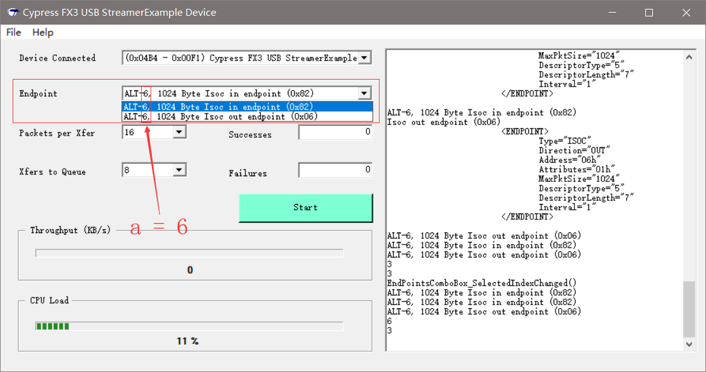

# Why StreamExample Always Select Alt6

## EndPointsComboBox只会留下Alt6节点信息 

```C#
[...省略]
/*Summary
   Recursive routine populates EndPointsComboBox with strings 
   representing all the endpoints in the device.
*/
private void GetEndpointsOfNode(TreeNode devTree)
{
    EndPointsComboBox.Items.Clear();                // 这里会清除之前的节点，导致只留下了最后的Alt6节点
    foreach (TreeNode node in devTree.Nodes)
    {
        if (node.Nodes.Count > 0)
            GetEndpointsOfNode(node);               // 递归
        else
        {
            CyUSBEndPoint ept = node.Tag as CyUSBEndPoint;
            if (ept == null)
            {
                //return;
            }
            else if (!node.Text.Contains("Control"))
            {
                CyUSBInterface ifc = node.Parent.Tag as CyUSBInterface;
                string s = string.Format("ALT-{0}, {1} Byte {2}", ifc.bAlternateSetting, ept.MaxPktSize, node.Text);
                EndPointsComboBox.Items.Add(s);
            }
            
        }
    }

}
[...省略]
```

## 自动选择接口描述符流程

```C#
[...省略]
/*Summary
   Search the device with VID-PID 04b4-00F1 and if found, select the end point
*/
private void SetDevice(bool bPreserveSelectedDevice)
{
    [...省略]
        PpxBox.Text = "16"; //Set default value to 8 Packets
        QueueBox.Text = "8";
        if (EndPointsComboBox.Items.Count > 0)
        {
            /**
             * ALT-6, 1024 Byte Isoc in endpoint (0x82)
             * ALT-6, 1024 Byte Isoc out endpoint (0x06)
             */
            EndPointsComboBox.SelectedIndex = 0;            // 设置索引，会自动触发对应的事件
            StartBtn.Enabled = true;
        }
        else StartBtn.Enabled = false;

    [...省略]
}
[...省略]
/*Summary
 This is a system event handler, when the selected index changes(end point selection).
*/
private void EndPointsComboBox_SelectedIndexChanged(object sender, EventArgs e)
{
    // Get the Alt setting
    // EndPointsComboBox.Text = "ALT-6, 1024 Byte Isoc in endpoint (0x82)"
    string sAlt = EndPointsComboBox.Text.Substring(4, 1);
    byte a = Convert.ToByte(sAlt);
    MyDevice.AltIntfc = a;                                  // a = 6

    // Get the endpoint
    int aX = EndPointsComboBox.Text.LastIndexOf("0x");
    string sAddr = EndPointsComboBox.Text.Substring(aX, 4);
    byte addr = (byte)Util.HexToInt(sAddr);

    EndPoint = MyDevice.EndPointOf(addr);

    // Ensure valid PPX for this endpoint
    PpxBox_SelectedIndexChanged(sender, null);
}
[...省略]
```


