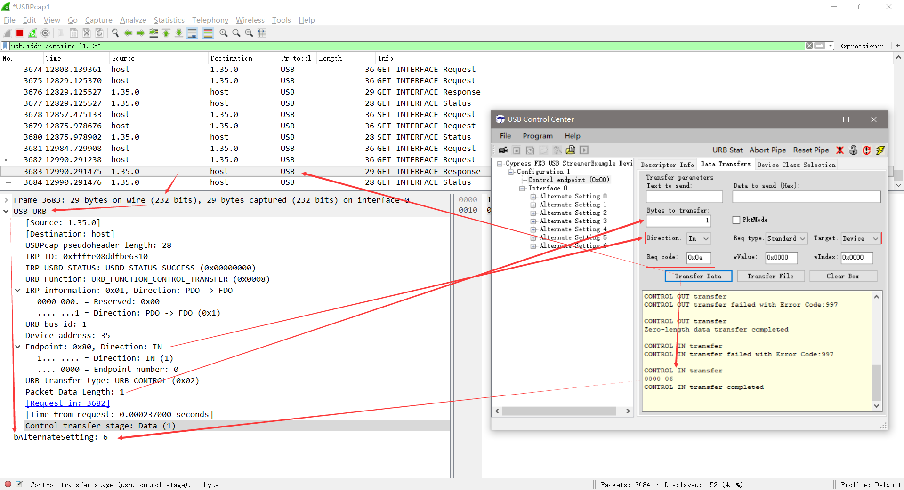
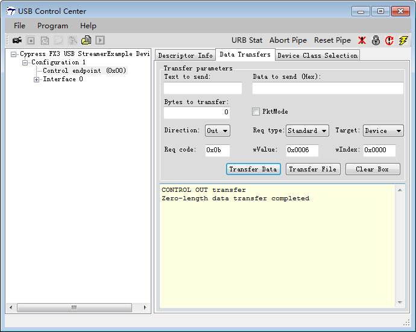

# Send Setup Packet

## 参考文档

* [The Setup Packet](https://www.beyondlogic.org/usbnutshell/usb6.shtml)

## 测似方法

* 使用`USB Control Center`直接发送`Setup Packet`；
* 获取`AlternateSetting`的值；
* `bRequest`：
  * `GET_INTERFACE (0x0A)`；
  * `SET_INTERFACE (0x0B)`；
* 单片机实现方法：
  ```C
  BOOL DR_GetInterface(void)       // Called when a Set Interface command is received
  {
      EP0BUF[0] = AlternateSetting;
      EP0BCH = 0;
      EP0BCL = 1;
      return(TRUE);            // Handled by user code
  }
  ```
* 测试验证：  
    
  