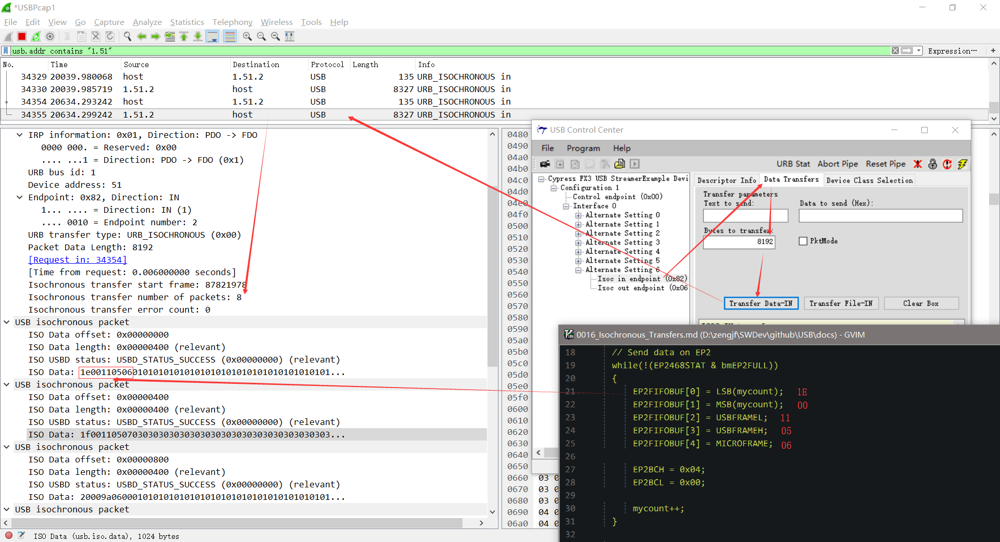
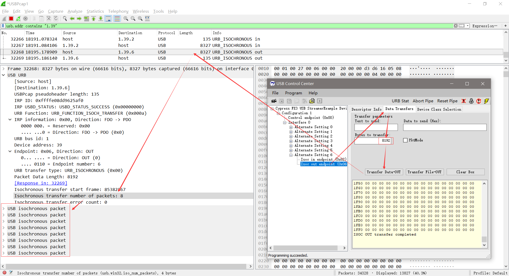

# Isochronous Transfers

## 参考文档

* [Isochronous Transfers](https://www.keil.com/pack/doc/mw/USB/html/_u_s_b__isochronous__transfers.html):  
  An Isochronous pipe sends a new data packet in **every frame**, regardless of the success or failure of the last packet.
* [USB Protocol](https://www.keil.com/pack/doc/mw/USB/html/_u_s_b__protocol.html)

A special packet is the Start-of-Frame packet (SOF) that splits the USB bus into time segments. Each pipe is allocated a slot in each frame. The Start-of-Frame packet is sent every 1ms on full speed links. At high speed, the 1ms frame is divided into 8 microframes of 125μs each. A Start-of-Frame packet is sent at the beginning of each microframe using the same frame number. The frame number increments every 1ms.

## Isochronous IN

* 处理同步数据方法
  ```C
  [...省略]
  case Alt6_IsocINOUT:
  {
      // Send data on EP2
      while(!(EP2468STAT & bmEP2FULL))
      {
          EP2FIFOBUF[0] = LSB(mycount);
          EP2FIFOBUF[1] = MSB(mycount);
          EP2FIFOBUF[2] = USBFRAMEL;
          EP2FIFOBUF[3] = USBFRAMEH;
          EP2FIFOBUF[4] = MICROFRAME;
  
          EP2BCH = 0x04;
          EP2BCL = 0x00;
  
          mycount++;
      }
  
      // check EP6 EMPTY(busy) bit in EP2468STAT (SFR), core set's this bit when FIFO is empty
      if(!(EP2468STAT & bmEP6EMPTY))
      { 
          EP6BCL = 0x80;          // re(arm) EP6OUT
      }
  }
  break;
  [...省略]
  ```
* 运行效果  
  
* 目前不知道为什么端点缓冲区是1k Byte，但是发送的数据却至少要8k Byte的倍数，难道是因为至少用1ms来算？暂不追查原理。
* StreamExample采用的是16k Byte的参数；

## Isochronous OUT


