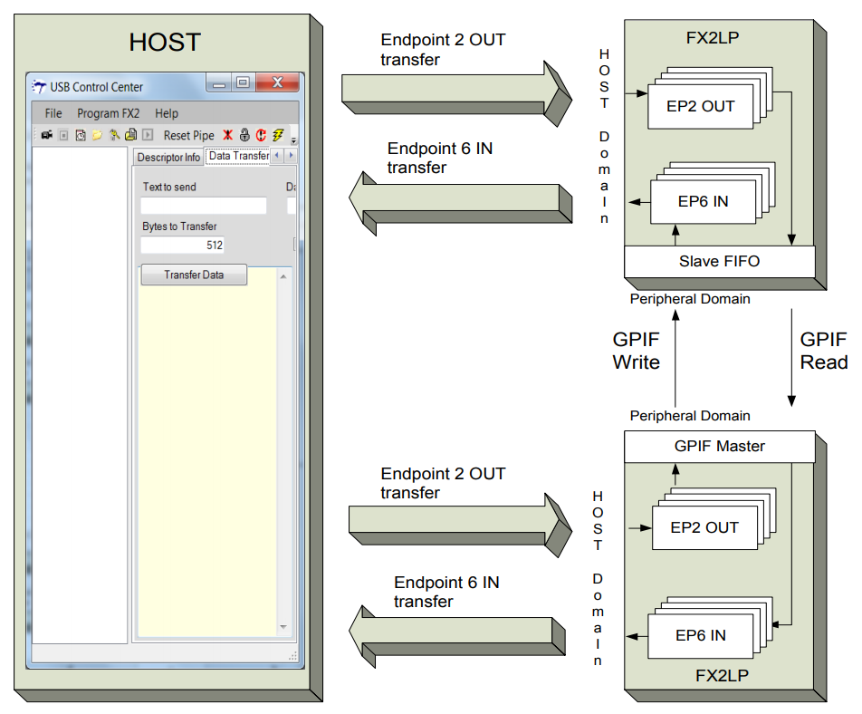
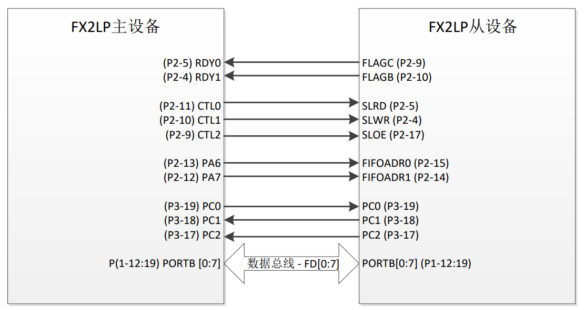

# GPIF

## 参考文档

* [通过 GPIF 使 SRAM 与 FX2LP 相互连接](https://www.cypress.com/file/134606/download)
* [AN63787 - EZ-USB® FX2LP™ GPIF and Slave FIFO Configuration Examples Using an 8-Bit Asynchronous Interface](https://www.cypress.com/documentation/application-notes/an63787-ez-usb-fx2lp-gpif-and-slave-fifo-configuration-examples)
  * [EZ-USB FX2LP GPIF And Slave FIFO Configuration Examples Using An 8-Bit Asynchronous Interface](https://www.cypress.com/file/202291/download)
* [AN66806 - Getting Started with EZ-USB® FX2LP™ GPIF](https://www.cypress.com/documentation/application-notes/an66806-getting-started-ez-usb-fx2lp-gpif)
  * [EZ-USB® FX2LP™ GPIF 入门](https://www.cypress.com/file/135391/download)

## 参考源代码

* [AN63787 EZ-USB FX2LP GPIF and Slave FIFO Configuration Examples Using an 8-Bit Asynchronous Interface.zip](https://www.cypress.com/file/44776/download)

## 系统框图

* 两个 FX2LP 芯片相连：一个工作于 GPIF 模式，另一个工作于 Slave FIFO 模式。
* EP2 — BULK OUT、512 个字节、四缓冲
* EP6 — BULK IN、512 个字节，四缓冲

## FIFO Connect

* 主设备引脚：
  * CTL[5:0]是可编程的控制输出，可将它们作为选通，读/写线或其他输出使用。该应用程序使用的控制信号（CTL0、CTL1 和 CTL2）连接到从设备的 SLRD、SLWR 和 SLOE。
  * RDY[5:0]为“就绪”输入，可对它们进行采样，并允许数据传输等待（插入等待状态）、继续或重复，直到该信号处于合适的电平为止。该过程使用了 RDY0 和 RDY1 来控制数据流。RDY0 连接着从设备的 FLAGC（EP2 空标志），而 RDY1 连接着从设备的 FLAGB（EP6 满标志）。
  * 主设备 FX2LP 使用端口 A 引脚[6, 7]来驱动由主设
  备访问的 Slave FIFO 地址。
  * PC2（SLAVEREADY）是从设备到主设备的输入，表示目前从设备已经复位，其固件准备就绪。这是为了防止主设备在从设备复位前或在复位过程中读取其 EP6 FIFO 中任何无效值。
  * 对于手动操作模式，从设备和主设备间进行的交换需要其他两条线来实现主出从入的传输。PC0（Txn_Over）和 PC1（Pkt_Committed）用于实现此目的。后面各章节说明了更多有关这些引脚使用情况的信息。
* 从设备引脚：
  * FLAGB 和 FLAGC 用于报告 Slave FIFO 的状态。
  * FLAGB — EP6FF（端点 6 满标志）表示 EP6 FIFO 的“满”状态。
  * FLAGC — EP6FF（端点 2 空标志）表示 EP2 FIFO 的“空”状态。
  * 所使用的 Slave FIFO 控制引脚分别是 SLOE（从设备输出使能）、SLRD（从设备读取）、SLWR（从设备写入）和 FIFOADR[1:0]（FIFO 选择）。
  * FIFOADR[1:0]引脚用于选择与数据总线相连接的四个 FIFO（由外部主设备控制）。
  * PC2 是从设备的输出，在从设备复位后它被设置为高电平，因此准备好了它的固件。
  * FD[0:7] 这是被配置为 8 位数据总线的端口 B。如果设置任意 EPxFIFOCG 寄存器的 WORDWIDE（EPxFIFOCG.0）位 ， 那么端口 D 将被配置为 FD[8:15] 。 所有四个 WORLDWIDE 位的或操作，会导致 PORTD 成为 PORTD 或者 FD[15：8]。每一个单独的 WORLDWIDE 位指示每个单独的端点数据如何传递。这种传递使用 8-bit 接口如何该过程使用了一个 8 位的接口。

