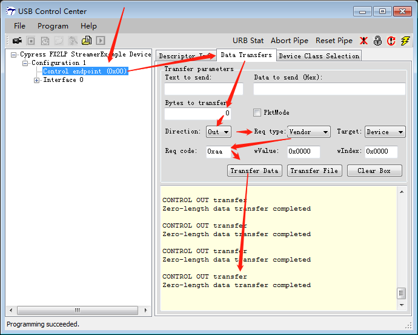

# Vendor Command

## 参考文档

* [Create Your Own USB Vendor Commands Using FX2LP™](https://www.cypress.com/file/202971/download)
* [Interfacing FX2LP™ with Image Sensor – KBA95736](https://community.cypress.com/docs/DOC-9329)

## Source

https://github.com/ZengjfOS/USB/tree/VendorCMD

## Vendor Commands Steps

